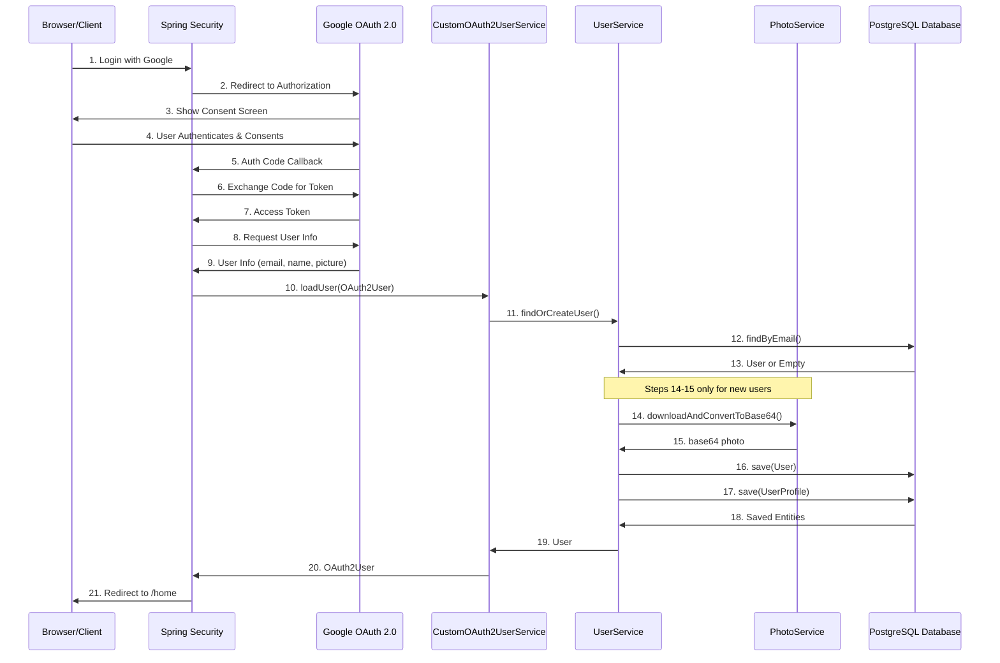

# Design: Google OAuth Authentication

## Architecture Overview

### Component Flow
```
┌─────────────────────────────────────────────────────────────┐
│                     Browser/Client                          │
└────────────────────┬────────────────────────────────────────┘
                     │
                     │ 1. /oauth2/authorization/google
                     ▼
┌─────────────────────────────────────────────────────────────┐
│              Spring Security Filter Chain                   │
│  - OAuth2AuthorizationRequestRedirectFilter                 │
│  - OAuth2LoginAuthenticationFilter                          │
└────────────────────┬────────────────────────────────────────┘
                     │
                     │ 2. Redirect to Google
                     ▼
┌─────────────────────────────────────────────────────────────┐
│                  Google OAuth 2.0                           │
└────────────────────┬────────────────────────────────────────┘
                     │
                     │ 3. Callback with auth code
                     ▼
┌─────────────────────────────────────────────────────────────┐
│            CustomOAuth2UserService                          │
│  - Load user from Google                                    │
│  - Download profile photo                                   │
│  - Convert photo to base64                                  │
└────────────────────┬────────────────────────────────────────┘
                     │
                     │ 4. Create/Update user
                     ▼
┌─────────────────────────────────────────────────────────────┐
│              UserService                                    │
│  - Find or create User                                      │
│  - Create UserProfile on first login                        │
└────────────────────┬────────────────────────────────────────┘
                     │
                     ▼
┌─────────────────────────────────────────────────────────────┐
│         UserRepository / UserProfileRepository              │
└────────────────────┬────────────────────────────────────────┘
                     │
                     ▼
┌─────────────────────────────────────────────────────────────┐
│                  PostgreSQL Database                        │
└─────────────────────────────────────────────────────────────┘
```

### OAuth Authentication Sequence Diagram



**Flow Description:**

1. User clicks "Login with Google"
2. Spring Security redirects to Google Authorization endpoint
3. Google displays consent screen to user
4. User authenticates and grants permissions
5. Google redirects back with authorization code
6. Spring Security exchanges code for access token
7. Google returns access token
8. Spring Security requests user info using token
9. Google returns user info (email, name, picture URL)
10. Spring Security calls CustomOAuth2UserService.loadUser()
11. CustomOAuth2UserService calls UserService.findOrCreateUser()
12. UserService queries database for existing user by email
13. Database returns user or empty result
14. If new user: UserService calls PhotoService to download profile photo
15. PhotoService returns base64-encoded photo
16. UserService saves User entity to database
17. UserService saves UserProfile entity to database
18. Database returns saved entities
19. UserService returns User to CustomOAuth2UserService
20. CustomOAuth2UserService returns OAuth2User to Spring Security
21. Spring Security creates session and redirects to /home

**Note:** Steps 14-15 only occur for new users during first login.

## Data Model

### User Entity (Updated)
**Implements:** REQ-005, REQ-006

```java
@Entity
@Table(name = "user", schema = "home_app")
@Data
@NoArgsConstructor
@AllArgsConstructor
public class User {
    @Id
    @GeneratedValue(strategy = GenerationType.IDENTITY)
    private Long id;
    
    @Column(nullable = false, unique = true, length = 255)
    private String email;
    
    @Column(name = "first_name", nullable = false, length = 100)
    private String firstName;
    
    @Column(name = "last_name", nullable = false, length = 100)
    private String lastName;
    
    @Column(nullable = false)
    private Boolean enabled = true;
    
    @Column(name = "created_at", nullable = false, updatable = false)
    private Timestamp createdAt;
    
    @Column(name = "updated_at", nullable = false)
    private Timestamp updatedAt;
    
    @OneToOne(mappedBy = "user", cascade = CascadeType.ALL, fetch = FetchType.LAZY)
    private UserProfile userProfile;
}
```

### UserProfile Entity (Updated)
**Implements:** REQ-004, REQ-007

```java
@Entity
@Table(name = "user_profile", schema = "home_app")
@Data
@NoArgsConstructor
@AllArgsConstructor
public class UserProfile {
    @Id
    @GeneratedValue(strategy = GenerationType.IDENTITY)
    private Long id;
    
    @OneToOne
    @JoinColumn(name = "user_id", nullable = false, unique = true)
    private User user;
    
    @Column(columnDefinition = "TEXT")
    private String photo; // Base64 encoded image
    
    @Column(length = 20)
    private String phone;
    
    @Column(name = "social_networks", columnDefinition = "TEXT")
    private String socialNetworks; // JSON or comma-separated
    
    @Column(name = "created_at", nullable = false, updatable = false)
    private Timestamp createdAt;
    
    @Column(name = "updated_at", nullable = false)
    private Timestamp updatedAt;
}
```

### DTOs

**GoogleUserInfoDTO**
```java
@Data
public class GoogleUserInfoDTO {
    private String email;
    private String givenName;
    private String familyName;
    private String picture; // URL to profile picture
}
```

**UserDTO** (existing, may need updates)
```java
@Data
public class UserDTO {
    private Long id;
    private String email;
    private String firstName;
    private String lastName;
    private Boolean enabled;
}
```

## Component Design

### Security Configuration
**Implements:** REQ-001

**Class:** `SecurityConfig`
**Package:** `com.jorgemonteiro.home_app.config`

```java
@Configuration
@EnableWebSecurity
public class SecurityConfig {
    
    @Autowired
    private CustomOAuth2UserService customOAuth2UserService;
    
    @Bean
    public SecurityFilterChain filterChain(HttpSecurity http) throws Exception {
        http
            .authorizeHttpRequests(auth -> auth
                .requestMatchers("/", "/login", "/error").permitAll()
                .anyRequest().authenticated()
            )
            .oauth2Login(oauth2 -> oauth2
                .userInfoEndpoint(userInfo -> userInfo
                    .userService(customOAuth2UserService)
                )
                .defaultSuccessUrl("/home", true)
                .failureUrl("/login?error=true")
            )
            .logout(logout -> logout
                .logoutSuccessUrl("/")
                .invalidateHttpSession(true)
                .deleteCookies("JSESSIONID")
            );
        
        return http.build();
    }
}
```

### Custom OAuth2 User Service
**Implements:** REQ-002, REQ-003, REQ-004

**Class:** `CustomOAuth2UserService`
**Package:** `com.jorgemonteiro.home_app.service`

```java
@Service
public class CustomOAuth2UserService extends DefaultOAuth2UserService {
    
    @Autowired
    private UserService userService;
    
    @Autowired
    private PhotoService photoService;
    
    @Override
    public OAuth2User loadUser(OAuth2UserRequest userRequest) throws OAuth2AuthenticationException {
        OAuth2User oauth2User = super.loadUser(userRequest);
        
        String email = oauth2User.getAttribute("email");
        String givenName = oauth2User.getAttribute("given_name");
        String familyName = oauth2User.getAttribute("family_name");
        String pictureUrl = oauth2User.getAttribute("picture");
        
        // Find or create user
        User user = userService.findOrCreateUser(email, givenName, familyName, pictureUrl);
        
        return oauth2User;
    }
}
```

### User Service
**Implements:** REQ-002, REQ-003, REQ-004

**Class:** `UserService`
**Package:** `com.jorgemonteiro.home_app.service`

```java
@Service
@Transactional
public class UserService {
    
    @Autowired
    private UserRepository userRepository;
    
    @Autowired
    private UserProfileRepository userProfileRepository;
    
    @Autowired
    private PhotoService photoService;
    
    public User findOrCreateUser(String email, String firstName, String lastName, String pictureUrl) {
        return userRepository.findByEmail(email)
            .orElseGet(() -> createNewUser(email, firstName, lastName, pictureUrl));
    }
    
    private User createNewUser(String email, String firstName, String lastName, String pictureUrl) {
        User user = new User();
        user.setEmail(email);
        user.setFirstName(firstName);
        user.setLastName(lastName);
        user.setEnabled(true);
        user.setCreatedAt(new Timestamp(System.currentTimeMillis()));
        user.setUpdatedAt(new Timestamp(System.currentTimeMillis()));
        
        user = userRepository.save(user);
        
        // Create user profile
        UserProfile profile = new UserProfile();
        profile.setUser(user);
        profile.setCreatedAt(new Timestamp(System.currentTimeMillis()));
        profile.setUpdatedAt(new Timestamp(System.currentTimeMillis()));
        
        // Download and convert photo to base64
        if (pictureUrl != null && !pictureUrl.isEmpty()) {
            String base64Photo = photoService.downloadAndConvertToBase64(pictureUrl);
            profile.setPhoto(base64Photo);
        }
        
        userProfileRepository.save(profile);
        user.setUserProfile(profile);
        
        return user;
    }
}
```

### Photo Service
**Implements:** REQ-003, REQ-004

**Class:** `PhotoService`
**Package:** `com.jorgemonteiro.home_app.service`

```java
@Service
public class PhotoService {
    
    private static final Logger log = LoggerFactory.getLogger(PhotoService.class);
    
    public String downloadAndConvertToBase64(String imageUrl) {
        try {
            URL url = new URL(imageUrl);
            try (InputStream in = url.openStream()) {
                byte[] imageBytes = in.readAllBytes();
                return Base64.getEncoder().encodeToString(imageBytes);
            }
        } catch (Exception e) {
            log.error("Failed to download profile photo from: {}", imageUrl, e);
            return null;
        }
    }
}
```

### Repository Updates

**UserRepository**
```java
@Repository
public interface UserRepository extends JpaRepository<User, Long> {
    Optional<User> findByEmail(String email);
}
```

**UserProfileRepository**
```java
@Repository
public interface UserProfileRepository extends JpaRepository<UserProfile, Long> {
    Optional<UserProfile> findByUserId(Long userId);
}
```

## Database Design

### Migration: Change Primary Keys
**Implements:** REQ-005, REQ-006

**File:** `src/main/resources/db/changelog/sql/03-migrate-user-primary-keys.sql`

```sql
--liquibase formatted sql

--changeset jorge:migrate-user-primary-keys
-- Add new id columns
ALTER TABLE home_app.user ADD COLUMN id BIGSERIAL;
ALTER TABLE home_app.user_profile ADD COLUMN id BIGSERIAL;
ALTER TABLE home_app.user_profile ADD COLUMN user_id BIGINT;

-- Populate user_id in user_profile
UPDATE home_app.user_profile up
SET user_id = (SELECT u.id FROM home_app.user u WHERE u.email = up.email);

-- Drop old foreign key constraint
ALTER TABLE home_app.user_profile DROP CONSTRAINT IF EXISTS fk_user_profile_user;

-- Drop old primary keys
ALTER TABLE home_app.user_profile DROP CONSTRAINT IF EXISTS user_profile_pkey;
ALTER TABLE home_app.user DROP CONSTRAINT IF EXISTS user_pkey;

-- Set new primary keys
ALTER TABLE home_app.user ADD PRIMARY KEY (id);
ALTER TABLE home_app.user_profile ADD PRIMARY KEY (id);

-- Add unique constraint on email
ALTER TABLE home_app.user ADD CONSTRAINT uk_user_email UNIQUE (email);

-- Add foreign key constraint
ALTER TABLE home_app.user_profile 
ADD CONSTRAINT fk_user_profile_user 
FOREIGN KEY (user_id) REFERENCES home_app.user(id) ON DELETE CASCADE;

-- Add unique constraint on user_id
ALTER TABLE home_app.user_profile ADD CONSTRAINT uk_user_profile_user_id UNIQUE (user_id);

-- Create index on email
CREATE INDEX idx_user_email ON home_app.user(email);

--rollback ALTER TABLE home_app.user_profile DROP CONSTRAINT uk_user_profile_user_id;
--rollback ALTER TABLE home_app.user_profile DROP CONSTRAINT fk_user_profile_user;
--rollback DROP INDEX IF EXISTS home_app.idx_user_email;
--rollback ALTER TABLE home_app.user DROP CONSTRAINT uk_user_email;
--rollback ALTER TABLE home_app.user_profile DROP CONSTRAINT user_profile_pkey;
--rollback ALTER TABLE home_app.user DROP CONSTRAINT user_pkey;
--rollback ALTER TABLE home_app.user ADD PRIMARY KEY (email);
--rollback ALTER TABLE home_app.user_profile ADD PRIMARY KEY (email);
--rollback ALTER TABLE home_app.user_profile DROP COLUMN user_id;
--rollback ALTER TABLE home_app.user_profile DROP COLUMN id;
--rollback ALTER TABLE home_app.user DROP COLUMN id;
```

### Migration: Add Photo Column
**Implements:** REQ-004

**File:** `src/main/resources/db/changelog/sql/04-add-user-profile-photo.sql`

```sql
--liquibase formatted sql

--changeset jorge:add-user-profile-photo
ALTER TABLE home_app.user_profile ADD COLUMN photo TEXT;

--rollback ALTER TABLE home_app.user_profile DROP COLUMN photo;
```

### Migration: Add Timestamps
**File:** `src/main/resources/db/changelog/sql/05-add-timestamps.sql`

```sql
--liquibase formatted sql

--changeset jorge:add-timestamps
ALTER TABLE home_app.user 
ADD COLUMN created_at TIMESTAMP NOT NULL DEFAULT CURRENT_TIMESTAMP,
ADD COLUMN updated_at TIMESTAMP NOT NULL DEFAULT CURRENT_TIMESTAMP;

ALTER TABLE home_app.user_profile 
ADD COLUMN created_at TIMESTAMP NOT NULL DEFAULT CURRENT_TIMESTAMP,
ADD COLUMN updated_at TIMESTAMP NOT NULL DEFAULT CURRENT_TIMESTAMP;

--rollback ALTER TABLE home_app.user_profile DROP COLUMN created_at, DROP COLUMN updated_at;
--rollback ALTER TABLE home_app.user DROP COLUMN created_at, DROP COLUMN updated_at;
```

## Configuration

### Application Properties
**File:** `src/main/resources/application.yaml`

```yaml
spring:
  security:
    oauth2:
      client:
        registration:
          google:
            client-id: ${GOOGLE_CLIENT_ID}
            client-secret: ${GOOGLE_CLIENT_SECRET}
            scope:
              - email
              - profile
            redirect-uri: "{baseUrl}/login/oauth2/code/{registrationId}"
        provider:
          google:
            authorization-uri: https://accounts.google.com/o/oauth2/v2/auth
            token-uri: https://oauth2.googleapis.com/token
            user-info-uri: https://www.googleapis.com/oauth2/v3/userinfo
            user-name-attribute: sub
```

### Environment Variables
- `GOOGLE_CLIENT_ID`: OAuth 2.0 Client ID from Google Cloud Console
- `GOOGLE_CLIENT_SECRET`: OAuth 2.0 Client Secret from Google Cloud Console

## Security Design

### Authentication Flow
**Implements:** REQ-001, NFR-001

1. User clicks "Login with Google"
2. Spring Security redirects to Google OAuth consent screen
3. User authenticates with Google and grants permissions
4. Google redirects back with authorization code
5. Spring Security exchanges code for access token
6. `CustomOAuth2UserService` loads user info from Google
7. User is created/updated in database
8. Session is established
9. User is redirected to home page

### Token Handling
- OAuth tokens are managed by Spring Security
- Tokens are not stored in database
- Session-based authentication after OAuth flow completes

### Error Handling
**Implements:** AC-005

- OAuth failures redirect to `/login?error=true`
- Photo download failures are logged but don't block authentication
- Duplicate email attempts are prevented by unique constraint
- Database errors during user creation are rolled back

## Error Handling

### Exception Types
- `OAuth2AuthenticationException`: Google authentication failures
- `DataIntegrityViolationException`: Duplicate email attempts
- `IOException`: Photo download failures

### Error Responses
- Failed authentication: Redirect to login with error parameter
- Photo download failure: Log error, continue with null photo
- Database constraint violation: Return 500 with error message

## Technology Decisions

### Spring Security OAuth2 Client
- **Rationale**: Native Spring Boot integration, well-documented, actively maintained
- **Alternative Considered**: Custom OAuth implementation (rejected due to complexity)

### Base64 Photo Storage
- **Rationale**: Simple implementation, no file storage infrastructure needed
- **Trade-off**: Larger database size, slower queries
- **Future Optimization**: Move to S3 or file storage

### Sequential ID Primary Keys
- **Rationale**: Better performance, supports multiple auth providers, standard practice
- **Alternative Considered**: UUID (rejected due to index performance)

## Performance Considerations

### Photo Download
- Asynchronous download to avoid blocking authentication (future enhancement)
- Timeout handling for slow Google responses
- Fallback to null if download fails

### Database Indexes
- Index on `user.email` for fast lookup
- Unique constraint enforces data integrity
- Foreign key index on `user_profile.user_id`

## Testing Strategy

See `tasks.md` for detailed testing tasks. Key areas:
- OAuth flow integration tests
- User creation on first login
- Existing user login
- Photo download and base64 conversion
- Database migration validation
- Error handling scenarios
