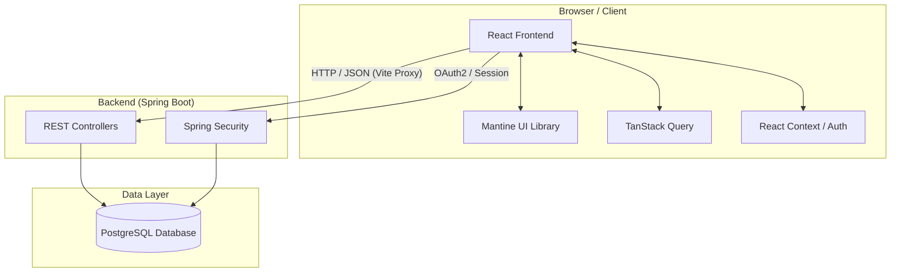
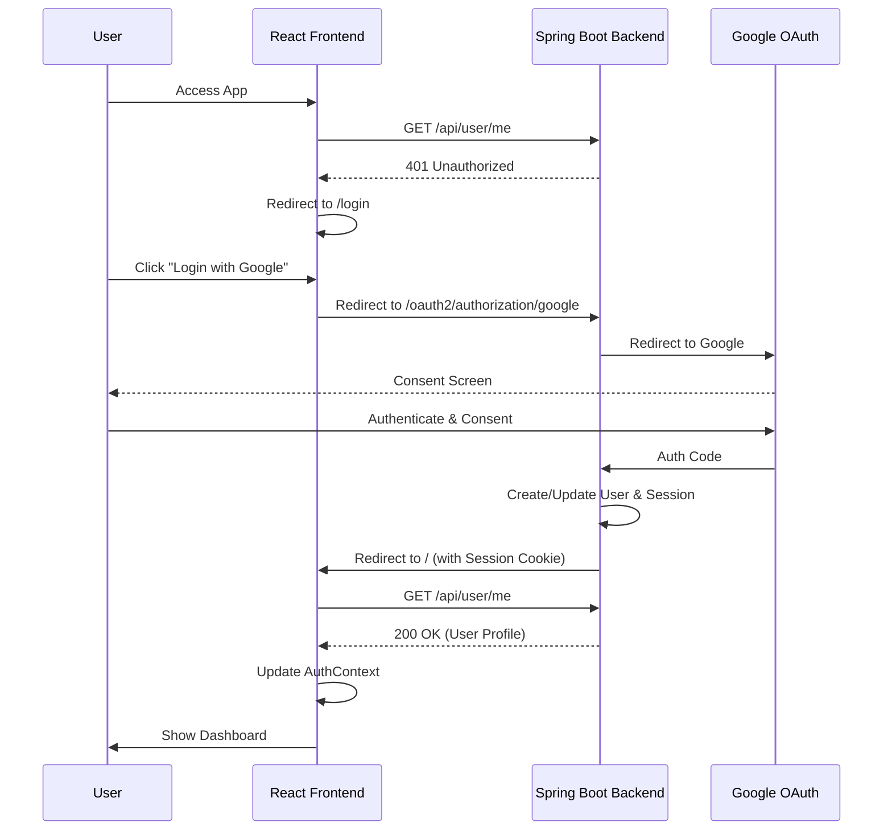

# Design: Frontend Initial Setup

## Architecture Overview

### System Architecture
The application follows a decoupled architecture with a Spring Boot backend and a React frontend.



### Module Structure
A new Gradle module `home-app-frontend` is added to the root project.

```
home-app/
├── build.gradle.kts
├── settings.gradle.kts
├── home-app-backend/         # Existing Spring Boot backend
└── home-app-frontend/        # New React frontend module
    ├── package.json
    ├── vite.config.ts
    ├── tsconfig.json
    ├── build.gradle.kts       # Gradle integration
    ├── src/
    │   ├── main.tsx
    │   ├── App.tsx
    │   ├── components/       # Reusable UI components
    │   ├── pages/            # Page components (Login, Dashboard)
    │   ├── hooks/            # Custom hooks (useAuth, useProfile)
    │   ├── services/         # API client & services
    │   ├── context/          # React Context (AuthContext)
    │   └── theme/            # Mantine theme configuration
    └── tests/                # Playwright E2E tests
```

## Frontend Architecture

### Core Technologies
- **React 19+**: UI Library.
- **TypeScript**: Type safety.
- **Vite**: Build tool and development server.
- **Mantine 9+**: UI component library.
- **React Router 7**: Client-side routing.
- **TanStack Query (v5+)**: Server state management and data fetching.
- **Playwright**: End-to-end testing.

### Authentication Flow
The frontend delegates authentication to the backend's OAuth2 implementation.



### State Management
-   **AuthContext**: Stores the current user profile and authentication status.
-   **TanStack Query**: Manages caching and synchronization for API data (e.g., user profile).

## Component Design

### App Layout (AppShell)
Using Mantine's `AppShell` to provide a consistent header and content area.

-   **Header**:
    -   Application Logo/Name.
    -   User Profile Section: `Avatar` (using base64 photo), `Text` (Name/Email), and a `Menu` for Logout.
-   **Main**: `Outlet` for React Router.

### Protected Route
A wrapper component that checks the `AuthContext`.
```tsx
const ProtectedRoute = ({ children }: { children: React.ReactNode }) => {
  const { user, isLoading } = useAuth();
  
  if (isLoading) return <LoadingOverlay visible />;
  if (!user) return <Navigate to="/login" replace />;
  
  return children;
};
```

## Build & Integration

### Gradle Node Plugin
The `com.github.node-gradle.node` plugin will be used to synchronize `npm` tasks with Gradle.

-   `assemble` task depends on `npm_run_build`.
-   `check` task depends on `npm_run_lint` and `npm_test` (Playwright).

### Vite Proxy Configuration
To avoid CORS issues during development, Vite will proxy API requests to the backend.

```ts
// vite.config.ts
export default defineConfig({
  server: {
    proxy: {
      '/api': 'http://localhost:8080',
      '/oauth2': 'http://localhost:8080',
      '/login/oauth2': 'http://localhost:8080',
      '/logout': 'http://localhost:8080',
    },
  },
});
```

## Testing Strategy

### E2E Testing (Playwright)
-   **Authentication Flow**: Verify redirect to Google (mocked or handled), successful login, and session persistence.
-   **Layout**: Verify header displays correct user information.
-   **Protected Routes**: Verify redirection for unauthenticated users.

### Linting & Formatting
-   **ESLint**: Enforce React and TypeScript best practices.
-   **Prettier**: Enforce consistent code style.

## Technology Decisions

### Mantine UI
-   **Rationale**: Comprehensive set of accessible components, built-in hooks, and excellent TypeScript support. Fits the "Home App" aesthetic requirements.

### TanStack Query
-   **Rationale**: Industry standard for server state in React. Handles caching, loading states, and retries out of the box.

### Vite Proxy
-   **Rationale**: Simplest way to handle development-time auth and API calls without complex CORS configuration on the backend.

## Performance Considerations
-   **Bundle Splitting**: Vite automatically splits chunks for better loading performance.
-   **Optimized Images**: Profile photos are provided as base64 from the backend; ensure they are reasonably sized (handled by backend during download).
-   **Loading States**: Granular loading states (skeletons) to improve perceived performance.
