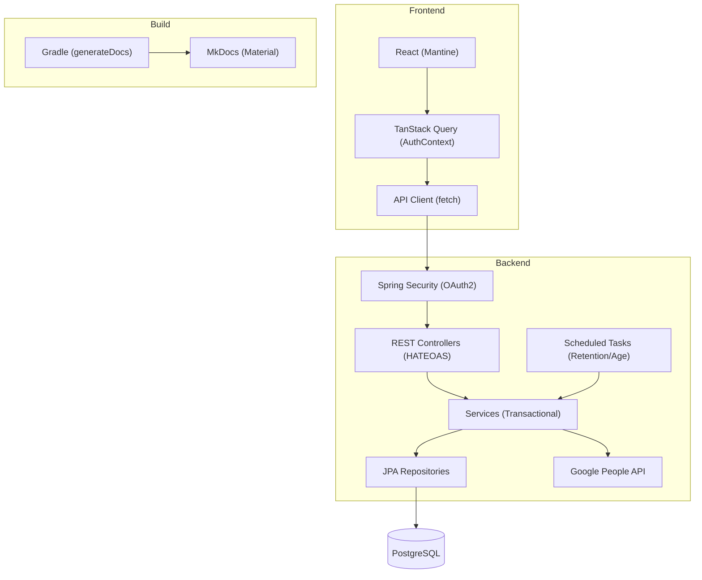
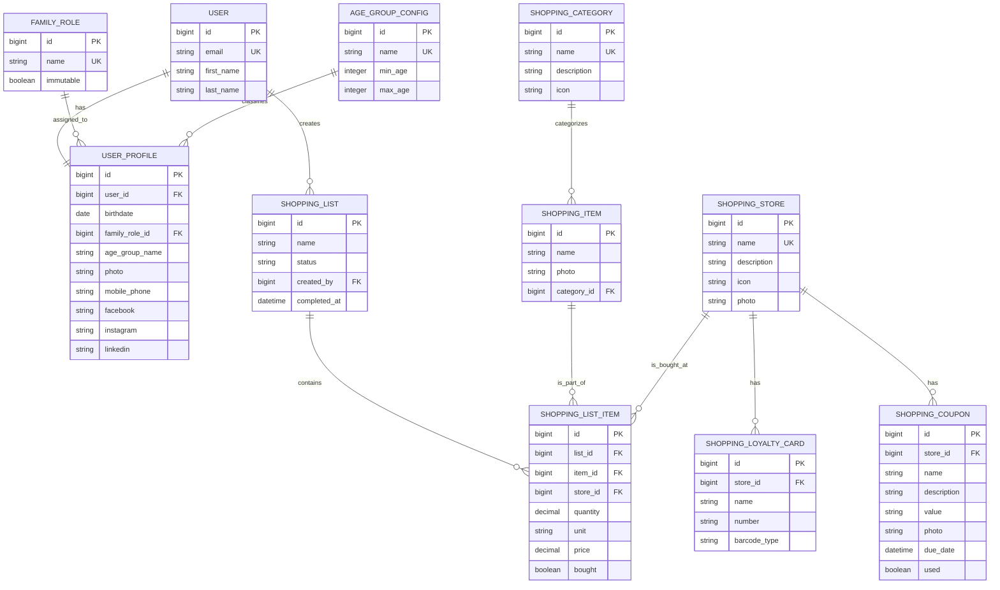

# Design: Home Application

## 1. Implementation Strategy
The Home Application follows a modern full-stack architecture, leveraging a Spring Boot backend and a React frontend. The design prioritizes **collaborative real-time updates**, **security (Zero Trust)**, and **modular navigation**.

For profile updates (FR-4), we employ a **Full Resource Update (PUT)** strategy to sync OAuth2-managed data. For utility modules like Shopping Lists, we employ a **Relational Master-Detail** strategy where shared household data is synced via TanStack Query.

## 2. Framework Rationalization
| Framework/Library | Intent & Purpose |
|-------------------|------------------|
| **Spring Boot 3.4** | Core backend framework for DI, Security, and REST. |
| **Spring Security** | OAuth2 Client and session management. |
| **React 19** | Core frontend library with Concurrent Mode features. |
| **Mantine 7** | UI component library for consistent and accessible design. |
| **TanStack Query v5** | Server state management, caching, and optimistic updates. |
| **Liquibase** | DB schema versioning and migration management. |
| **Tabler Icons** | SVG icon system for UI elements. |
| **react-barcode** | Generates Code 128 barcodes for loyalty cards. |
| **qrcode.react** | Generates QR codes for loyalty cards. |
| **MkDocs** | Documentation generator using Markdown. |
| **Material for MkDocs** | Professional theme for documentation site. |

## 3. Component Design

### Layered Architecture Diagram


### UI Components

#### Main Sidebar (Navigation)
**Description:** Modular navigation with nested menus for all application features. (*Implements: FR-14*)
- **Structure:**
    - **Dashboard** (Home)
    - **Shopping** (Parent)
        - Lists (Active/Archived)
        - Stores (inc. Loyalty Cards & Coupons)
        - Categories
        - Items
    - **Settings** (Parent - Adults Only)
        - Family Roles
        - Age Groups
- **Behavior:** Parent items expand to show sub-menus. Active sub-menu is highlighted.
- **State:** Persistent expanded/collapsed state via `localStorage`.

#### User Profile Dropdown (Header)
**Description:** A detailed summary menu in the application header. (*Implements: FR-3*)
- **Conditional Sections:** Phone number and social links (Facebook, Instagram, LinkedIn) only render if data is present.
- **Icons:** Uses `@tabler/icons-react` for all platform visual cues.

#### Barcode & QR Display
**Description:** Renders loyalty card numbers for scanning at store checkouts. (*Implements: FR-12*)
- **Code 128:** Uses `react-barcode` for linear 1D representation.
- **QR Code:** Uses `qrcode.react` for 2D representation.
- **Selection:** User selects format when adding the card.

#### Coupon Warning Panel
**Description:** Dashboard widget for unused, urgent coupons. (*Implements: FR-15*)
- **Logic:** Highlights coupons where `due_date - current_date < 4 days` and `used == false`.

### API Schemas & Contracts

#### 1. Authentication & Profiles
**GET /api/user/me**
**Response (application/hal+json):**
```typescript
interface UserProfileResource {
  id: number;
  email: string;
  firstName: string;
  lastName: string;
  birthdate?: string; // ISO-8601 Date
  ageGroupName: "Adult" | "Teenager" | "Child";
  familyRoleId?: number;
  familyRoleName?: string;
  photo: string; // Base64 or URL
  facebook?: string;
  instagram?: string;
  linkedin?: string;
  mobilePhone?: string;
  _links: {
    self: { href: string };
  };
}
```

**PUT /api/user/me**
**Request Body:**
```typescript
interface UserProfileUpdateRequest {
  birthdate?: string;    // Required if missing
  familyRoleId?: number; // Exactly one role
  photo?: string;        // Base64 string or URL
  facebook?: string;     // Valid FB URL or empty
  instagram?: string;    // Valid IG URL or empty
  linkedin?: string;     // Valid LI URL or empty
  mobilePhone?: string;  // Valid format (7-20 chars) or empty
}
```

#### 2. Settings Module (Adults Only)
**Base Path:** `/api/settings`

**GET /api/settings/age-groups** -> Returns `List<AgeGroupConfig>`.
**PUT /api/settings/age-groups**
```typescript
type AgeGroupUpdate = {
  id: number;
  minAge: number;
  maxAge: number;
}[];
```
**GET /api/settings/roles** -> Returns `List<FamilyRole>`.

#### 3. Shopping List Module
**Base Path:** `/api/shopping`

**Categories & Items**
- `GET /api/shopping/categories` -> `PagedModel<Category>`.
- `GET /api/shopping/items` -> `PagedModel<Item>`.

**Stores, Cards & Coupons**
- `GET /api/shopping/stores` -> `PagedModel<Store>`.
- `POST /api/shopping/stores/{id}/loyalty-cards`
```typescript
interface LoyaltyCardRequest {
  name: string;
  number: string;
  barcodeType: "QR" | "CODE_128";
}
```
- `POST /api/shopping/stores/{id}/coupons`
```typescript
interface CouponRequest {
  name: string;
  description: string;
  value: string; // Free text
  photo: string; // Base64
  dueDate: string; // ISO-8601
}
```

**Lists & Planning**
- `POST /api/shopping/lists/{id}/items`
```typescript
interface AddListItemRequest {
  itemId: number;
  storeId?: number;
  quantity: number;
  unit: "KG" | "G" | "L" | "ML" | "PACK" | "UNIT";
  price?: number;
}
```
- `PATCH /api/shopping/list-items/{id}`
```typescript
interface ListItemUpdate {
  bought: boolean;
  price?: number; // Final price paid
}
```

### Data Model & Schema Details



#### Database Migration (Liquibase Requirements)
1.  **Schema `profiles`:** 
    - Update `user_profiles` to add `birthdate`, `family_role_id`, and `age_group_name`.
    - Create `family_roles` and `age_group_config` tables.
2.  **Schema `shopping`:** All tables prefixed with `shopping_` in the ER diagram.
3.  **Audit Columns:** Every table MUST include `created_at`, `updated_at`, and `version` (for optimistic locking).
4.  **Soft Deletion:** Not required for lists; `FR-11` mandates physical deletion after 3 months.

### Documentation Strategy (MkDocs)
The project documentation is generated as a static site using MkDocs. (*Implements: FR-20, FR-21, FR-22*)

- **Structure:**
    - `docs/` -> Source markdown files.
    - `docs/architecture/` -> Design decisions and ER diagrams.
    - `docs/guidelines/` -> Coding standards (Java, Spock).
    - `docs/help/` -> User-facing "How-to" guides.
    - `mkdocs.yml` -> Configuration file (Material theme, search, mermaid, navigation).
- **Gradle Task:** `generateDocs`
    - Executes `mkdocs build`.
    - Outputs static HTML to `build/docs/`.
    - Requirements: `python` and `pip install mkdocs-material` in build environment.

## 4. Performance & Caching Strategy
### Backend Performance (Latency)
- **Database Indexing:** 
    - `users(email)`
    - `shopping_list_items(item_id, store_id, created_at DESC)` for price suggestions.
    - `shopping_coupons(used, due_date)` for dashboard warning performance.
- **Retention Task:** Daily at 02:00 AM to purge old lists. (*Implements: FR-11*)
- **Age Recalculation:** Background task daily at 00:01 AM or on user login. (*Implements: FR-16*)
- **Target:** 95% of requests < 150ms. (*Implements: NFR-2*)

### Frontend Caching (TanStack Query)
- **Stale-While-Revalidate:** `staleTime: 300000` (5 minutes) for master data.
- **Optimistic Sync:** `ListItem` check-off updates local cache immediately with background sync. (*Implements: NFR-3*)

## 5. Error Handling & Observability
### Error Handling Strategy
The system follows **RFC 7807 (Problem Detail)** for all backend errors.

#### Validation Errors (400 Bad Request)
Backend returns a `ProblemDetail` with an `errors` map. Example: `{ "mobilePhone": "Invalid format" }`.

#### Other Error States
- **401 Unauthorized:** Missing/expired session. Redirects to `/login`.
- **403 Forbidden:** Accessing Settings as a Non-Adult.
- **503 Service Unavailable:** DB or External API unreachable. (*Implements: NFR-3*)

## 6. Configuration & Environment
- **Variables:** `GOOGLE_CLIENT_ID`, `FRONTEND_URL`, `DATABASE_URL`.
- **OAuth2 Scopes:** Must include `https://www.googleapis.com/auth/user.birthday.read`.

## 7. Infrastructure & Deployment
- **Runtime:** Java 25, Node 22, Python 3.
- **Database:** PostgreSQL 16+.
- **Schema Management:** Liquibase with master changelog.
