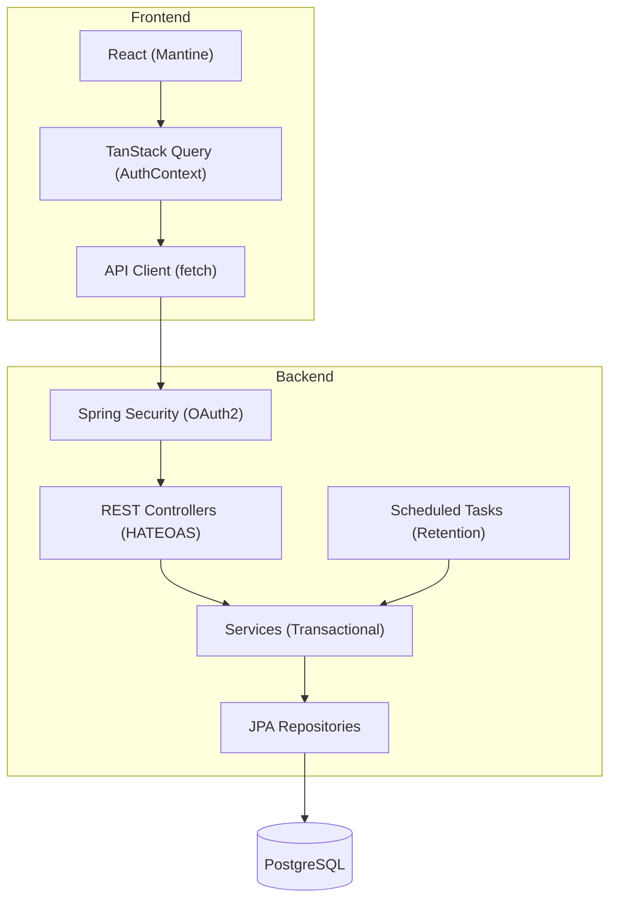
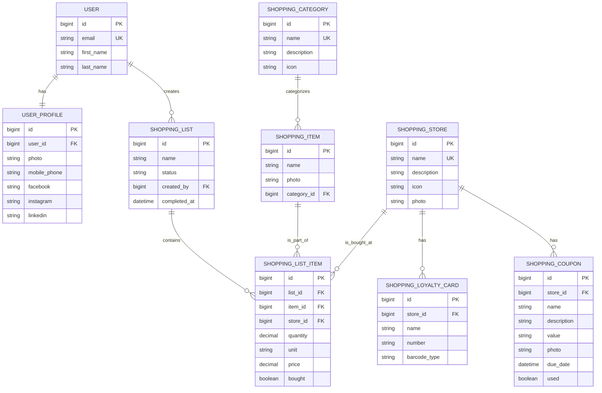

# Design: Home Application

## 1. Implementation Strategy
The Home Application follows a modern full-stack architecture, leveraging a Spring Boot backend and a React frontend. The design prioritizes **collaborative real-time updates**, **security (Zero Trust)**, and **modular navigation**.

For profile updates (FR-4), we employ a **Full Resource Update (PUT)** strategy to sync OAuth2-managed data. For utility modules like Shopping Lists, we employ a **Relational Master-Detail** strategy where shared household data is synced via TanStack Query.

## 2. Framework Rationalization
| Framework/Library | Intent & Purpose |
|-------------------|------------------|
| **Spring Boot 3.4** | Core backend framework for DI, Security, and REST. |
| **Spring Security** | OAuth2 Client and session management. |
| **React 19** | Core frontend library. |
| **Mantine 7** | UI component library for consistent design. |
| **TanStack Query v5** | Server state management and optimistic caching. |
| **Liquibase** | DB schema versioning. |
| **Tabler Icons** | SVG icon system for UI elements. |
| **react-barcode** | Generates Code 128 barcodes for loyalty cards. |
| **qrcode.react** | Generates QR codes for loyalty cards. |

## 3. Component Design

### Layered Architecture Diagram

### UI Components

#### Main Sidebar (Navigation)
**Description:** Modular navigation with nested menus. (*Implements: FR-14*)
- **Structure:**
    - **Dashboard**
    - **Shopping** (Parent)
        - Lists (Active/Archived)
        - Stores (inc. Loyalty Cards & Coupons)
        - Categories
        - Items
- **State:** Persistent expanded/collapsed state via `localStorage`.

#### User Profile Dropdown (Header)
**Description:** A detailed summary menu in the application header. (*Implements: FR-3*)
- **Conditional Sections:** Phone number and social links (Facebook, Instagram, LinkedIn) only render if data is present.
- **Icons:** Uses `@tabler/icons-react` for visual cues.

#### Barcode & QR Display
**Description:** Renders loyalty card numbers for scanning. (*Implements: FR-12*)
- **Logic:** Conditional rendering of `Barcode` (Code 128) or `QRCode` based on `barcode_type`.

#### Coupon Warning Panel
**Description:** Dashboard widget for urgent coupons. (*Implements: FR-15*)
- **Filter:** Highlights unused coupons where `due_date < 4 days`.

### API Schemas & Contracts

#### Authentication & Profiles
**GET /api/user/me** -> Returns `UserProfileResource`.
**PUT /api/user/me** -> Updates allowed profile fields.

#### Shopping List Module
**Base Path:** `/api/shopping`

**1. Categories & Items**
- `GET /api/shopping/categories` -> Returns `PagedModel<CategoryResource>`.
- `POST /api/shopping/categories` -> `{ "name": string, "description": string, "icon": string }`.
- `GET /api/shopping/items` -> Returns `PagedModel<ItemResource>`.
- `POST /api/shopping/items` -> `{ "name": string, "categoryId": Long, "photo": string }`.

**2. Stores, Loyalty & Coupons**
- `GET /api/shopping/stores` -> Returns `PagedModel<StoreResource>`.
- `POST /api/shopping/stores` -> `{ "name": string, "description": string, "icon": string }`.
- `POST /api/shopping/stores/{id}/loyalty-cards` -> `{ "name": string, "number": string, "barcodeType": "QR" | "CODE_128" }`.
- `POST /api/shopping/stores/{id}/coupons` -> `{ "name": string, "value": string, "dueDate": ISO8601, "photo": string }`.
- `PATCH /api/shopping/coupons/{id}` -> `{ "used": boolean }`.

**3. Lists & Planning**
- `GET /api/shopping/lists` -> Returns active/completed lists.
- `POST /api/shopping/lists` -> `{ "name": string }`.
- `POST /api/shopping/lists/{id}/items` -> `{ "itemId": Long, "storeId": Long?, "quantity": number, "unit": string, "price": number? }`.
- `PATCH /api/shopping/list-items/{id}` -> `{ "bought": boolean, "price": number? }`.
- `GET /api/shopping/price-suggestions?itemId={id}&storeId={id}?` -> Returns `{ "price": number, "source": "STORE" | "GLOBAL" }`.
### Data Model & Schema Details

#### Database Migration (Liquibase Requirements)
...

1.  **Schema `profiles`:** Handled in initial setup.
2.  **Schema `shopping`:** All new tables MUST reside in a dedicated `shopping` schema.
3.  **Audit Columns:** Every table in the `shopping` schema MUST include `created_at`, `updated_at`, and `version` (for optimistic locking).
4.  **Soft Deletion:** Not required for lists; `FR-11` mandates physical deletion after 3 months.

## 4. Performance & Caching Strategy
### Backend Performance (Latency)
- **Database Indexing:** 
    - `users(email)`
    - `shopping_list_items(item_id, store_id, created_at DESC)` for price history lookups.
    - `shopping_coupons(used, due_date)` for dashboard warning performance.
- **Retention Task:** Runs daily at 02:00 AM to purge lists older than 3 months. (*Implements: FR-11*)
- **Target:** 95% of requests < 150ms. (*Implements: NFR-2*)

### Frontend Caching (TanStack Query)
- **Stale-While-Revalidate:** `staleTime: 300000` (5 minutes) for master data (Categories, Items, Stores).
- **Optimistic Sync:** `ListItem` check-off updates the local cache immediately. Background sync ensures consistency for other household members. (*Implements: NFR-3*)

## 5. Error Handling & Observability
### Error Handling Strategy
The system follows **RFC 7807 (Problem Detail)** for all backend errors.

#### Validation Errors (400 Bad Request)
Backend returns a `ProblemDetail` with an `errors` map. Example: `{ "quantity": "Must be greater than zero" }`.

#### Other Error States
- **401 Unauthorized:** Redirects to `/login`.
- **404 Not Found:** Resource missing.
- **503 Service Unavailable:** Database or Google Auth unreachable. (*Implements: NFR-3*)

## 6. Configuration & Environment
- **Variables:** `GOOGLE_CLIENT_ID`, `FRONTEND_URL`, `DATABASE_URL`.

## 7. Infrastructure & Deployment
- **Runtime:** Java 25, Node 22.
- **Database:** PostgreSQL 16+.
- **Schema Management:** Liquibase with master changelog.
