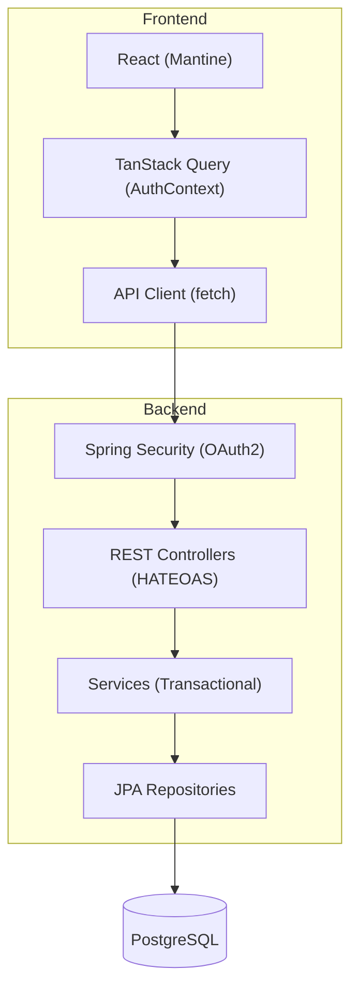

# Design: Home Application

## 1. Implementation Strategy
The Home Application follows a modern full-stack architecture, leveraging a Spring Boot backend and a React frontend. The design prioritizes **security (Zero Trust)** and **developer experience** through HATEOAS and automated profile synchronization.

For profile updates (FR-4), we employ a **Full Resource Update (PUT)** strategy. This ensures that the client remains the source of truth for the profile's state, while the backend enforces strict validation and maintains the immutability of OAuth2-managed fields (email, names).

## 2. Framework Rationalization
| Framework/Library | Intent & Purpose |
|-------------------|------------------|
| **Spring Boot 3.4** | Chosen for its robust ecosystem, dependency injection, and native support for Spring Security and OAuth2. |
| **Spring Security** | Used to handle the complex OAuth2 Client flow and session management with minimal custom boilerplate. |
| **React 19** | Modern UI library with Concurrent Mode features, providing a responsive and interactive user experience. |
| **Mantine 7** | A comprehensive UI library used to ensure accessible, consistent design with a focus on dark/light mode and professional layouts. |
| **Mantine Notifications** | Provides a standardized way to show toast notifications for background operations (e.g., successful profile update). |
| **TanStack Query v5** | Replaces manual `useEffect` data fetching. Manages caching, stale-while-revalidate logic, and global server state (e.g., updating profile state via mutations). |
| **Liquibase** | Ensures database schema evolution is versioned, reproducible, and tracked alongside code changes. |
| **Tabler Icons** | Provides a consistent set of high-quality SVG icons for the UI, including platform-specific social icons. |

## 3. Component Design

### Layered Architecture Diagram


### UI Components

#### User Profile Dropdown (Header)
**Description:** A detailed summary menu in the application header. (*Implements: FR-3*)
- **Conditional Sections:** Phone number and social links (Facebook, Instagram, LinkedIn) only render if the data is present in the `user` object from `AuthContext`.
- **Icons:** Uses `@tabler/icons-react` for all visual cues:
    - `IconPhone` for mobile numbers.
    - `IconBrandFacebook`, `IconBrandInstagram`, `IconBrandLinkedin` for social links.
    - `IconUserEdit` for the "View/Edit Profile" navigation link.

### API Schemas

#### GET /api/user/me
**Description:** Retrieves the profile of the currently authenticated user. (*Implements: FR-3*)
**Response (application/hal+json):**
```typescript
interface UserProfileResource {
  id: number;
  email: string;
  firstName: string;
  lastName: string;
  photo: string; // Base64 encoded or URL
  facebook?: string;
  instagram?: string;
  linkedin?: string;
  mobilePhone?: string;
  _links: {
    self: { href: string };
  };
}
```

#### PUT /api/user/me
**Description:** Updates the profile of the currently authenticated user. (*Implements: FR-4*)
**Request Body (application/json):**
```typescript
interface UserProfileUpdateRequest {
  photo?: string;        // Base64 string or URL
  facebook?: string;     // Valid FB URL or empty
  instagram?: string;    // Valid IG URL or empty
  linkedin?: string;     // Valid LI URL or empty
  mobilePhone?: string;  // Valid format (7-20 chars) or empty
}
```
**Constraint:** Fields `email`, `firstName`, and `lastName` MUST be ignored by the backend if provided in the request, as they are managed via OAuth2.

## 4. Error Handling & Observability
### Error Handling Strategy
The system follows **RFC 7807 (Problem Detail)** for all backend errors.

#### Validation Errors (400 Bad Request)
When validation fails, the backend returns a `ProblemDetail` with an `errors` map. The frontend MUST use `@mantine/form` to map these errors directly to form fields.

**Error Response Schema:**
```typescript
interface ValidationErrorResponse {
  type: string;          // e.g., "VALIDATION_ERROR"
  title: string;         // e.g., "Constraint Violation"
  status: 400;
  detail: string;        // e.g., "Validation failed for one or more fields"
  errors: {
    [fieldName: string]: string; // e.g., { "mobilePhone": "Mobile phone must be a valid phone number" }
  };
}
```

**UI Presentation:**
1. The `updateUserProfile` service returns the rejected promise with the response data.
2. The `onHeader` handler in the UI component extracts the `errors` map.
3. `form.setErrors(error.response.data.errors)` is called to display messages directly under the relevant `TextInput`.

#### Other Error States
- **401 Unauthorized:** Returned when a session is missing or expired. Redirects user to `/login`.
- **404 Not Found:** Returned when the authenticated user's record is missing in the DB.
- **500 Internal Server Error:** Returned for unhandled exceptions, including a unique `traceId` for log correlation.
- **503 Service Unavailable:** Returned if the database or critical external services are unreachable. (*Implements: NFR-3*)

### Observability
- **Logging:** All security events (login, logout, access denied) and profile updates MUST be logged at `INFO` level.
- **Tracing:** Every request SHALL have a `X-Trace-Id` generated at the entry point and propagated through the layers.

## 5. Configuration & Environment
| Variable | Usage |
|----------|-------|
| `GOOGLE_CLIENT_ID` | OAuth2 Credentials. |
| `FRONTEND_URL` | Base URL for redirection after login. |
| `DATABASE_URL` | PostgreSQL connection string. |

## 6. Infrastructure & Deployment
- **Runtime:** Java 25 (Backend), Node 22 (Frontend Build).
- **Database:** PostgreSQL 16+.
- **Scaling:** Stateless application nodes; sticky sessions are required unless a distributed session store (Redis) is implemented.
