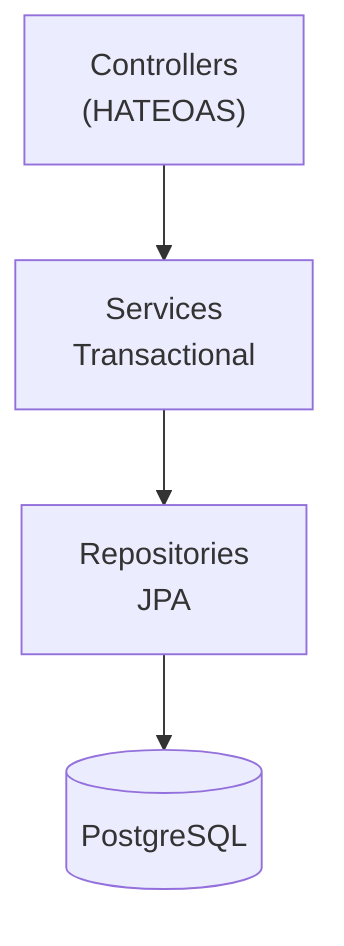
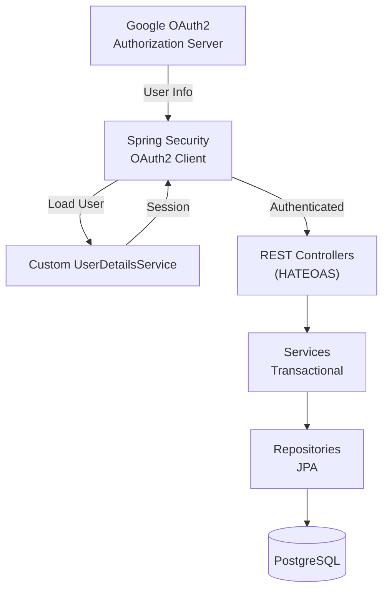

# Backend Architecture

## Overview

The Home Application backend is a robust **Spring Boot 4.0** service built with **Java 25**. It provides a secure, hypermedia-driven REST API, handles background automation, and manages complex family hierarchies and data retention policies.

<div class="grid cards" markdown>

-   :material-link-variant: **Hypermedia-Driven**
    
    Implements **HATEOAS** with HAL-formatted JSON, making the API discoverable and decoupled from the client.

-   :material-security: **OAuth2 Secure**
    
    Integrates **Spring Security** with Google OAuth2 for identity and session management, including cookie-based CSRF protection.

-   :material-cog-sync: **Automated Tasks**
    
    Built-in scheduling for critical background logic like age recalculation and automatic data retention.

</div>

---

## Layered Architecture

The backend follows a standard layered architecture to ensure separation of concerns and maintainability.



### Package Structure

```
com.jorgemonteiro.home_app/
├── controller.<schema>/    # REST Endpoints
├── service.<schema>/       # Business Logic
├── repository.<schema>/    # Data Access (JPA)
├── model/
│   ├── entities/           # DB Entities
│   ├── dtos/               # API Data Objects
│   └── adapter/            # Mappers (Entity ↔ DTO)
└── config/                 # Security & Beans
```

Schemas: `profiles`, `shopping`, `recipes`, `meals`, `notifications`, `media`.

---

## Security Architecture

### Google OAuth2 Integration

By leveraging Google OAuth2, the application offloads credential management while benefiting from Google's security features (MFA, phishing protection).



!!! warning "Access Control"
    All API endpoints require a valid OAuth2 session cookie. Non-authenticated requests to `/api/**` return `401 Unauthorized`.

---

## Scheduled Tasks

Spring Boot provides built-in scheduling support via `@Scheduled`.

### Data Retention (Shopping)

!!! note "[:octicons-clock-24: FR-11: Automatic Data Retention](../../requirements/shopping-list.md#fr-11)"

    System MUST identify and permanently delete shopping lists and items older than 3 months.

Runs daily at **02:00 AM**.

```java
@Scheduled(cron = "0 0 2 * * ?")
@Transactional
public void purgeOldLists() {
    LocalDateTime threshold = LocalDateTime.now().minusMonths(3);
    shoppingListRepository.deleteByCompletedAtBefore(threshold);
}
```

### Data Retention (Meals)

!!! note "[:octicons-clock-24: FR-34: Meal Plan Data Retention](../../requirements/recipes-meals.md#fr-34)"

    System MUST permanently delete meal plans older than 10 weeks, including all associated entries, recipes, and member records.

Runs daily at **03:00 AM**.

```java
@Scheduled(cron = "0 0 3 * * ?")
@Transactional
public void purgeOldMealPlans() {
    LocalDate threshold = LocalDate.now().minusWeeks(10);
    mealPlanRepository.deleteByWeekStartDateBefore(threshold);
}
```

### Meal Reminder Check

!!! note "[:material-bell-ring: FR-33: Meal Preparation Reminders](../../requirements/recipes-meals.md#fr-33)"

    System checks for upcoming meals with configured reminders and creates `MEAL_REMINDER` notifications.

!!! warning "Deferred"
    This scheduler is **scaffolded but not yet functional**. The `reminder_offset_minutes` column is not yet in the database schema.

Runs every **15 minutes**. Queries `meal_plan_entries` with `reminder_offset_minutes` set, creates notifications for meals where `(meal_time - reminder_offset)` falls within the next 15-minute window.

```java
@Scheduled(cron = "0 */15 * * * ?")
@Transactional
public void checkMealReminders() {
    // TODO: Not yet functional - schema column pending
}
```

### Age Recalculation

!!! note "[:octicons-person-24: FR-16: Automated Age Group Classification](../../requirements/auth-profile.md#fr-16)"

    System calculates the user's age based on birthdate and maps it to the configured Age Groups (Child, Teenager, Adult).

Runs daily at **00:01 AM** or upon user login.

---

## Performance & Optimization

!!! note "[:octicons-rocket-24: NFR-2: Performance (Latency)](../../requirements/shared.md#nfr-2)"

    **Target:** 95% of requests < 150ms. Core CRUD operations MUST be highly optimized.

**Optimized Indexes:**
- `users(email)`: Unique lookup for auth.
- `shopping_list_items(item_id, store_id, created_at DESC)`: Rapid price suggestions.
- `shopping_coupons(used, due_date)`: Efficient dashboard widgets.
- `recipe_ratings(recipe_id)`: Fast average rating calculation.
- `recipe_ingredients(recipe_id)`: Efficient ingredient listing.
- `recipe_steps(recipe_id, sort_order)`: Ordered step retrieval.
- `meal_plans(week_start_date)`: Quick week lookup.
- `meal_plan_entries(meal_plan_id)`: Efficient plan loading.
- `notifications(user_id, read, created_at DESC)`: Fast unread notification queries.

---

## Testing Strategy

The backend uses **Spock Framework** (Groovy) for all tests, with **Testcontainers** providing real PostgreSQL instances.

| Layer             | Purpose                        | Framework |
|-------------------|--------------------------------|-----------|
| **Unit**          | Service & Adapter logic        | Spock     |
| **Integration**   | Full API tests with real DB    | Spock + Testcontainers |
| **Security**      | OAuth2 & RBAC validation       | Spring Security Test |
| **External**      | Google People API simulation   | WireMock  |

---

## Technical Configuration

| Property | Default | Description |
|----------|---------|-------------|
| `spring.datasource.url` | `jdbc:postgresql://localhost:5432/homeapp` | Database connection string. |
| `spring.liquibase.enabled` | `true` | Enable schema migrations. |
| `app.frontend-url` | `http://localhost:5173` | Allowed origin for CORS. |
| `app.photo.max-size-bytes` | `2MB` | Limit for profile photo uploads. |

---

## Related Documentation

- [:material-api: API Reference](api/index.md)
- [:material-database: Database Design](../database/overview.md)
- [:material-test-tube: Test Scenarios](../test-strategy/test-scenarios.md)
