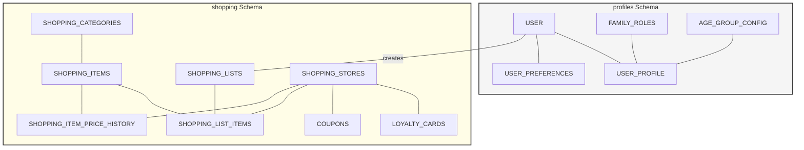
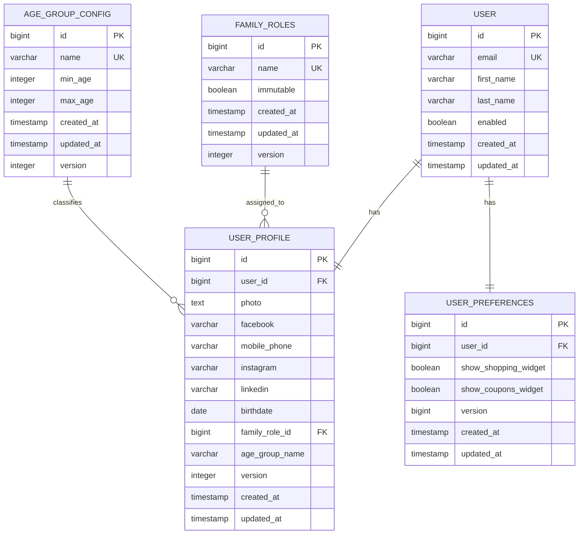
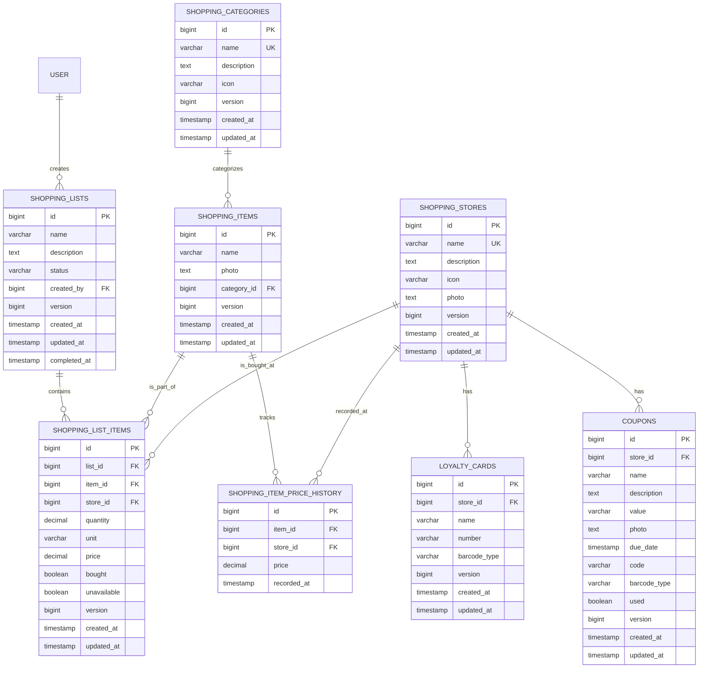

# Database Schema

## Overview

This document details the PostgreSQL 17 database schema, table relationships, and migration rules for the Home Application.

## Schemas

The database is organized into two distinct logical schemas:
- `profiles` - Identity, authentication, and family structure.
- `shopping` - Collaborative shopping lists, master catalog, and store-related data.

### System ER Overview

This diagram illustrates the high-level grouping and relationships between the `profiles` and `shopping` schemas.

---

## profiles Schema

This schema manages user accounts, extended profiles, family roles, and age-based classification.

### Detailed Entity Relationship Diagram

### Table Definitions

| Table | Description |
|-------|-------------|
| `user` | Core authentication records linked to Google identities. |
| `user_profile` | Extended user data including social links and birthdate. |
| `user_preferences` | UI-specific settings like dashboard widget visibility. |
| `family_roles` | Predefined (Mother, Father, etc.) and custom family roles. |
| `age_group_config` | Definable age ranges used for automated classification. |

---

## shopping Schema

This schema contains all data related to the shopping experience, including shared lists and store management.

### Detailed Entity Relationship Diagram

### Table Definitions

| Table | Description |
|-------|-------------|
| `shopping_lists` | Shared lists with status tracking (ACTIVE, COMPLETED). |
| `shopping_list_items` | Individual entries in a list, including prices and check-off status. |
| `shopping_items` | Master catalog of items shared across the household. |
| `shopping_categories` | Taxonomies for organizing shopping items. |
| `shopping_stores` | Favorite shopping locations. |
| `loyalty_cards` | Digital storage for store cards with Barcode/QR support. |
| `coupons` | Store-specific discounts with expiration tracking. |
| `shopping_item_price_history` | Historical price data used for intelligent suggestions. |

---

## Technical Standards

### Common Columns
Every table (excluding junction or history tables) MUST include the following audit columns:
- `created_at` TIMESTAMP NOT NULL DEFAULT CURRENT_TIMESTAMP
- `updated_at` TIMESTAMP NOT NULL DEFAULT CURRENT_TIMESTAMP
- `version` BIGINT NOT NULL DEFAULT 0 (Used for Optimistic Locking)

### Optimistic Locking
The application uses the `version` column to implement optimistic locking. Any update that detects a version mismatch SHALL throw a `ValidationException`.

### Data Retention
!!! note "[:octicons-clock-24: FR-11: Automatic Data Retention](../../requirements/shopping-list.md#fr-11)"

    Completed shopping lists and their items older than 3 months are physically deleted by a daily scheduled task to maintain performance.

---

## Related Documentation

- [:material-server: Backend Architecture](../backend/overview.md)
- [:material-cog-sync: Automated Tasks](../backend/overview.md#scheduled-tasks)
- [:material-test-tube: Test Scenarios](../test-strategy/test-scenarios.md)
