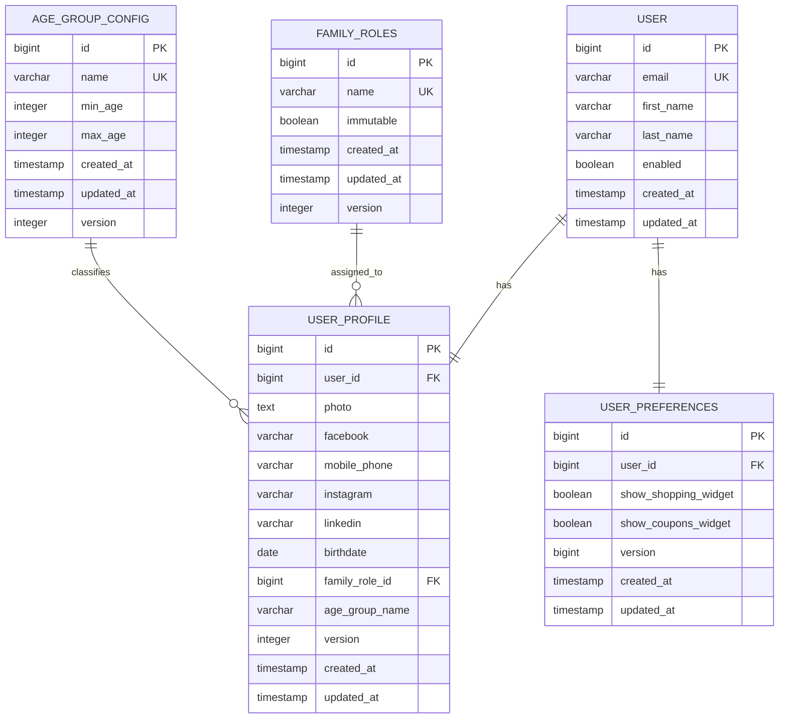
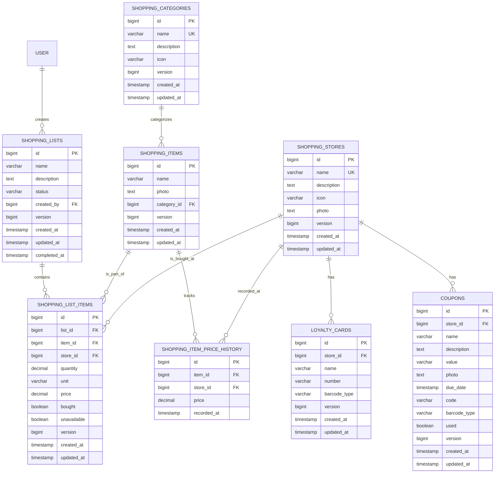
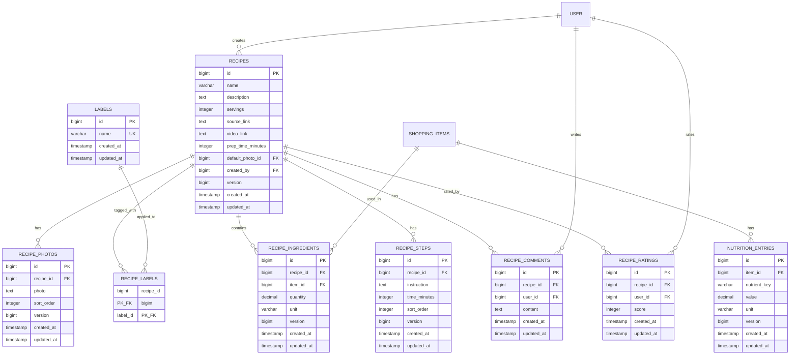
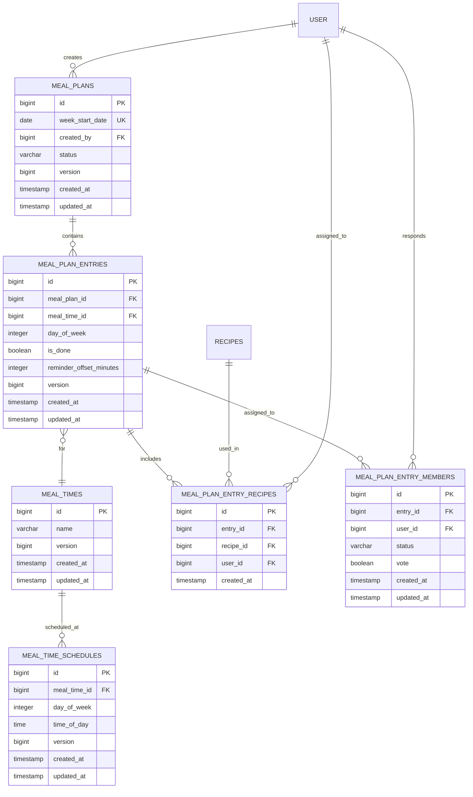
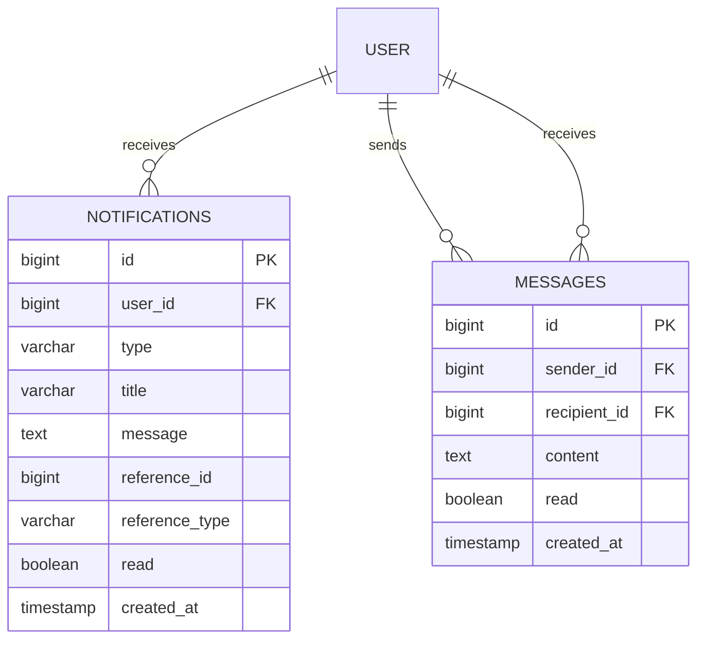

# Database Schema

## Overview

This document details the PostgreSQL 17 database schema, table relationships, and migration rules for the Home Application.

## Schemas

The database is organized into five distinct logical schemas:
- `profiles` - Identity, authentication, and family structure.
- `shopping` - Collaborative shopping lists, master catalog, and store-related data.
- `recipes` - Family cookbook: recipes, photos, labels, ingredients, steps, comments, ratings, and nutrition.
- `meals` - Meal time configuration, weekly meal plans, and approval workflows.
- `notifications` - In-app notifications and direct messaging.

### System ER Overview

This diagram illustrates the high-level grouping and relationships between all schemas.

```mermaid
flowchart TB
    subgraph profiles_schema [profiles Schema]
        direction TB
        USER
        USER_PROFILE
        USER_PREFERENCES
        FAMILY_ROLES
        AGE_GROUP_CONFIG

        USER --- USER_PROFILE
        USER --- USER_PREFERENCES
        FAMILY_ROLES --- USER_PROFILE
        AGE_GROUP_CONFIG --- USER_PROFILE
    end

    subgraph shopping_schema [shopping Schema]
        direction TB
        SHOPPING_LISTS
        SHOPPING_CATEGORIES
        SHOPPING_ITEMS
        SHOPPING_STORES
        LOYALTY_CARDS
        COUPONS
        SHOPPING_LIST_ITEMS
        SHOPPING_ITEM_PRICE_HISTORY

        SHOPPING_CATEGORIES --- SHOPPING_ITEMS
        SHOPPING_STORES --- LOYALTY_CARDS
        SHOPPING_STORES --- COUPONS
        SHOPPING_LISTS --- SHOPPING_LIST_ITEMS
        SHOPPING_ITEMS --- SHOPPING_LIST_ITEMS
        SHOPPING_STORES --- SHOPPING_LIST_ITEMS
        SHOPPING_ITEMS --- SHOPPING_ITEM_PRICE_HISTORY
        SHOPPING_STORES --- SHOPPING_ITEM_PRICE_HISTORY
    end

    subgraph recipes_schema [recipes Schema]
        direction TB
        RECIPES
        RECIPE_PHOTOS
        LABELS
        RECIPE_INGREDIENTS
        RECIPE_STEPS
        RECIPE_COMMENTS
        RECIPE_RATINGS
        NUTRITION_ENTRIES

        RECIPES --- RECIPE_PHOTOS
        RECIPES --- RECIPE_INGREDIENTS
        RECIPES --- RECIPE_STEPS
        RECIPES --- RECIPE_COMMENTS
        RECIPES --- RECIPE_RATINGS
        SHOPPING_ITEMS --- NUTRITION_ENTRIES
    end

    subgraph meals_schema [meals Schema]
        direction TB
        MEAL_TIMES
        MEAL_TIME_SCHEDULES
        MEAL_PLANS
        MEAL_PLAN_ENTRIES
        MEAL_PLAN_ENTRY_RECIPES
        MEAL_PLAN_ENTRY_MEMBERS

        MEAL_TIMES --- MEAL_TIME_SCHEDULES
        MEAL_PLANS --- MEAL_PLAN_ENTRIES
        MEAL_PLAN_ENTRIES --- MEAL_PLAN_ENTRY_RECIPES
        MEAL_PLAN_ENTRIES --- MEAL_PLAN_ENTRY_MEMBERS
    end

    subgraph notifications_schema [notifications Schema]
        direction TB
        NOTIFICATIONS
        MESSAGES
    end

    %% Cross-schema relationships
    USER -- "creates" --- SHOPPING_LISTS
    USER -- "creates" --- RECIPES
    USER -- "creates" --- MEAL_PLANS
    USER -- "receives" --- NOTIFICATIONS
    USER -- "sends" --- MESSAGES
    SHOPPING_ITEMS -- "ingredient_of" --- RECIPE_INGREDIENTS
    RECIPES -- "assigned_to" --- MEAL_PLAN_ENTRY_RECIPES

    style profiles_schema fill:#f5f5f5,stroke:#333,stroke-width:2px
    style shopping_schema fill:#fffde7,stroke:#333,stroke-width:2px
    style recipes_schema fill:#e8f5e9,stroke:#333,stroke-width:2px
    style meals_schema fill:#e3f2fd,stroke:#333,stroke-width:2px
    style notifications_schema fill:#fce4ec,stroke:#333,stroke-width:2px
```

---

## profiles Schema

This schema manages user accounts, extended profiles, family roles, and age-based classification.

### Detailed Entity Relationship Diagram

### Table Definitions

| Table | Description |
|-------|-------------|
| `user` | Core authentication records linked to Google identities. |
| `user_profile` | Extended user data including social links and birthdate. |
| `user_preferences` | UI-specific settings like dashboard widget visibility. |
| `family_roles` | Predefined (Mother, Father, etc.) and custom family roles. |
| `age_group_config` | Definable age ranges used for automated classification. |

---

## shopping Schema

This schema contains all data related to the shopping experience, including shared lists and store management.

### Detailed Entity Relationship Diagram

### Table Definitions

| Table | Description |
|-------|-------------|
| `shopping_lists` | Shared lists with status tracking (ACTIVE, COMPLETED). |
| `shopping_list_items` | Individual entries in a list, including prices and check-off status. |
| `shopping_items` | Master catalog of items shared across the household. |
| `shopping_categories` | Taxonomies for organizing shopping items. |
| `shopping_stores` | Favorite shopping locations. |
| `loyalty_cards` | Digital storage for store cards with Barcode/QR support. |
| `coupons` | Store-specific discounts with expiration tracking. |
| `shopping_item_price_history` | Historical price data used for intelligent suggestions. |

---

## recipes Schema

This schema manages the family cookbook: recipes, photos, labels, ingredients, preparation steps, comments, ratings, and nutrition data.

### Detailed Entity Relationship Diagram

### Table Definitions

| Table | Description |
|-------|-------------|
| `recipes` | Core recipe records with metadata, markdown description, and creator reference. |
| `recipe_photos` | Base64-encoded photos with sort order. One can be designated as default via `recipes.default_photo_id`. |
| `labels` | Dynamic label catalog. Created on demand, auto-deleted when no recipe references them. |
| `recipe_labels` | Junction table linking recipes to labels (many-to-many). |
| `recipe_ingredients` | Links shopping items as recipe ingredients with quantity and unit (same enum as shopping: KG, G, L, ML, PACK, UNIT). |
| `recipe_steps` | Ordered preparation steps with markdown instructions and optional time. `sort_order` determines display order. |
| `recipe_comments` | User comments on recipes with author and timestamp. |
| `recipe_ratings` | Individual 1-5 star ratings per user per recipe (unique constraint on recipe_id + user_id). Average computed on-the-fly. |
| `nutrition_entries` | Flexible key-value-unit nutrition data per shopping item (0:N). e.g., `fat: 2.3 g`, `protein: 23.4 g`. Used for on-the-fly recipe nutrition calculation. |

### Cross-Schema References

| Column | References | On Delete |
|--------|-----------|-----------|
| `recipes.created_by` | `profiles.user(id)` | RESTRICT |
| `recipe_comments.user_id` | `profiles.user(id)` | CASCADE |
| `recipe_ratings.user_id` | `profiles.user(id)` | CASCADE |
| `recipe_ingredients.item_id` | `shopping.shopping_items(id)` | RESTRICT |
| `nutrition_entries.item_id` | `shopping.shopping_items(id)` | CASCADE |

---

## meals Schema

This schema manages meal time configuration, weekly meal plans, and the approval/feedback workflow.

### Detailed Entity Relationship Diagram

### Table Definitions

| Table | Description |
|-------|-------------|
| `meal_times` | Named meal occasions (e.g., Breakfast, Lunch, Dinner). |
| `meal_time_schedules` | Per-day-of-week time configuration for each meal time. `day_of_week` uses ISO 8601 (1=Monday, 7=Sunday). |
| `meal_plans` | Weekly plans with a unique `week_start_date` (Monday). Status: `DRAFT` or `PUBLISHED`. |
| `meal_plan_entries` | Individual meal slots: a specific meal time on a specific day. Supports `is_done` flag and optional `reminder_offset_minutes`. |
| `meal_plan_entry_recipes` | Recipes assigned to an entry. `user_id` is nullable — null means "for everyone". Supports multi-recipe meals. |
| `meal_plan_entry_members` | Tracks each member's response (`PENDING`, `ACCEPTED`, `CHANGED`) and optional thumbs up/down `vote`. |

### Cross-Schema References

| Column | References | On Delete |
|--------|-----------|-----------|
| `meal_plans.created_by` | `profiles.user(id)` | RESTRICT |
| `meal_plan_entry_recipes.recipe_id` | `recipes.recipes(id)` | RESTRICT |
| `meal_plan_entry_recipes.user_id` | `profiles.user(id)` | CASCADE |
| `meal_plan_entry_members.user_id` | `profiles.user(id)` | CASCADE |

---

## notifications Schema

This schema manages in-app notifications and direct messaging between household members.

### Detailed Entity Relationship Diagram

### Table Definitions

| Table | Description |
|-------|-------------|
| `notifications` | Typed notifications with polymorphic reference (`reference_id` + `reference_type`) to source entities. Types: `MEAL_PLAN_PUBLISHED`, `MEAL_REMINDER`, `MEAL_SUGGESTION_MADE`, `NEW_RECIPE_COMMENT`, `NEW_MESSAGE`. |
| `messages` | Direct messages between household members with read status tracking. |

### Cross-Schema References

| Column | References | On Delete |
|--------|-----------|-----------|
| `notifications.user_id` | `profiles.user(id)` | CASCADE |
| `messages.sender_id` | `profiles.user(id)` | CASCADE |
| `messages.recipient_id` | `profiles.user(id)` | CASCADE |

---

## Technical Standards

### Common Columns
Every table (excluding junction or history tables) MUST include the following audit columns:
- `created_at` TIMESTAMP NOT NULL DEFAULT CURRENT_TIMESTAMP
- `updated_at` TIMESTAMP NOT NULL DEFAULT CURRENT_TIMESTAMP
- `version` BIGINT NOT NULL DEFAULT 0 (Used for Optimistic Locking)

### Optimistic Locking
The application uses the `version` column to implement optimistic locking. Any update that detects a version mismatch SHALL throw a `ValidationException`.

### Data Retention
!!! note "[:octicons-clock-24: FR-11: Automatic Data Retention](../../requirements/shopping-list.md#fr-11)"

    Completed shopping lists and their items older than 3 months are physically deleted by a daily scheduled task to maintain performance.

---

## Related Documentation

- [:material-server: Backend Architecture](../backend/overview.md)
- [:material-cog-sync: Automated Tasks](../backend/overview.md#scheduled-tasks)
- [:material-test-tube: Test Scenarios](../test-strategy/test-scenarios.md)
