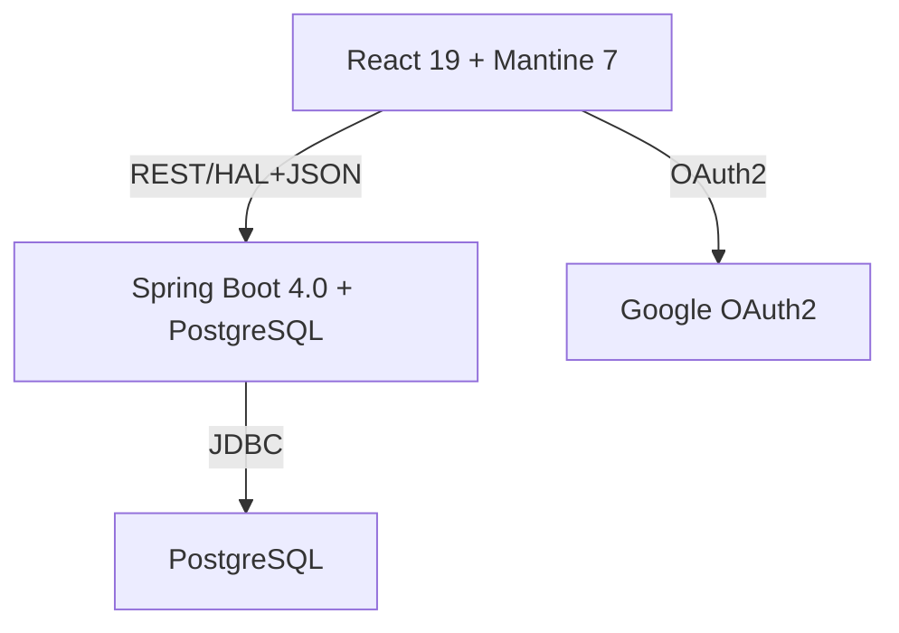
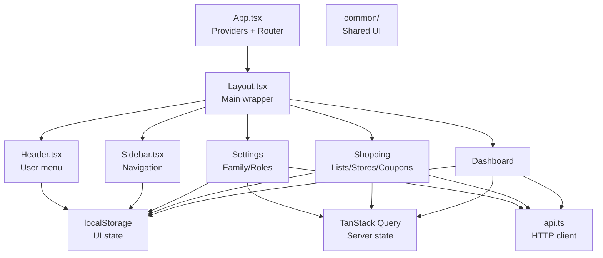
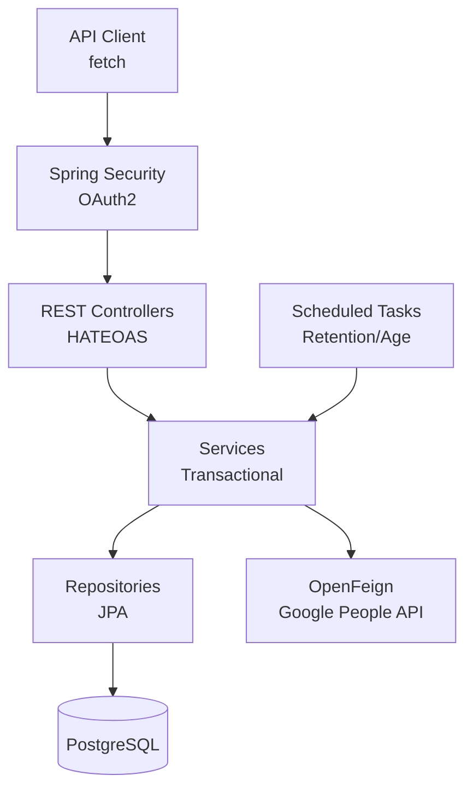
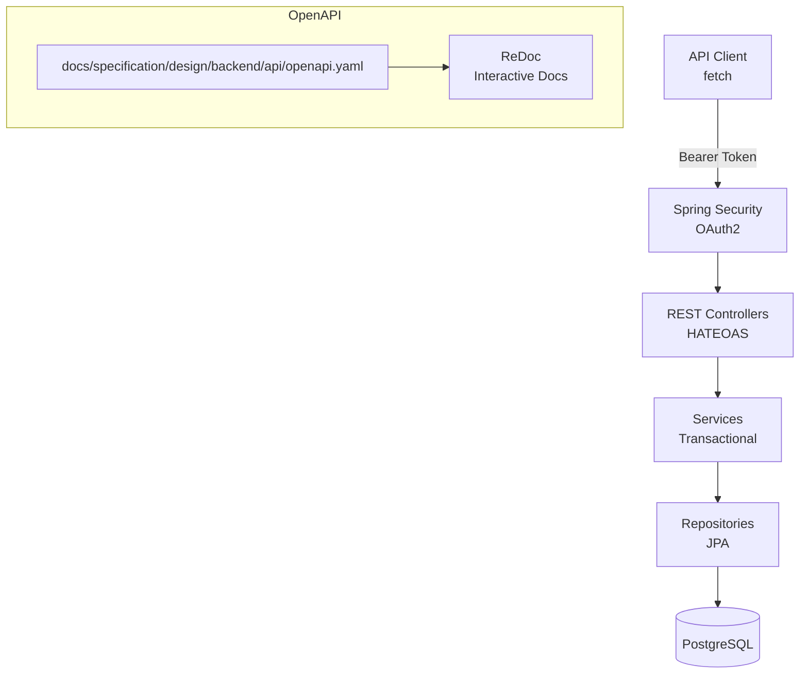

# Design: Home Application

## 1. Overview

The Home Application is a household management platform with a **Spring Boot backend** and **React frontend**. It provides modular features for family members to collaborate on shared resources including shopping, recipes, meal planning, and notifications.

### Core Principles

- **Collaborative real-time updates** via TanStack Query
- **Security (Zero Trust)** with Google OAuth2
- **Modular navigation** with nested menus

### Architecture at a Glance



---

## 2. Tech Stack

=== "Backend"

    | Framework | Role |
    |-----------|------|
    | :simple-spring: **Spring Boot 4.0** | Core backend framework for DI, Security, and REST. |
    | :fontawesome-solid-shield-halved: **Spring Security** | OAuth2 Client and session management. |
    | :fontawesome-solid-link: **Spring HATEOAS** | REST API with hypermedia controls (HAL format). |
    | :fontawesome-solid-database: **Spring Data JPA** | Database access and repository pattern. |
    | :fontawesome-solid-cloud: **OpenFeign** | Declarative HTTP client for Google People API integration. |
    | :fontawesome-solid-code-branch: **Liquibase** | DB schema versioning and migration management. |

=== "Frontend"

    | Framework | Role |
    |-----------|------|
    | :fontawesome-brands-react: **React 19** | Core frontend library with Concurrent Mode features. |
    | :fontawesome-solid-pen-nib: **Mantine 7** | UI component library for consistent and accessible design. |
    | :fontawesome-solid-layer-group: **TanStack Query v5** | Server state management, caching, and optimistic updates. |
    | :fontawesome-solid-icons: **@tabler/icons-react** | SVG icon system for UI elements. |
    | :fontawesome-solid-barcode: **react-barcode** | Generates Code 128 barcodes for loyalty cards. |
    | :fontawesome-solid-qrcode: **qrcode.react** | Generates QR codes for loyalty cards. |

=== "Testing"

    | Framework | Role |
    |-----------|------|
    | :simple-vitest: **Vitest** | Fast unit test runner for frontend with jsdom environment. |
    | :fontawesome-solid-bug: **Playwright** | E2E testing framework with MSW browser mocks. |
    | :fontawesome-solid-network-wired: **MSW** | API mocking for both unit and E2E tests. |
    | :simple-testcafe: **Spock** | Backend integration testing with Groovy. |
    | :simple-docker: **Testcontainers** | PostgreSQL containers for integration tests. |

=== "Build"

    | Framework | Role |
    |-----------|------|
    | :fontawesome-solid-book: **MkDocs** | Documentation generator using Markdown. |
    | :fontawesome-solid-palette: **Material for MkDocs** | Professional theme for documentation site. |
    | :fontawesome-solid-file-code: **ReDoc** | API documentation from OpenAPI 3.0 specifications. |
    | :simple-gradle: **Gradle** | Build automation and dependency management. |

---

## 3. Architecture Details

### Frontend Architecture

The frontend module is built with **React 19** and **Mantine 7**, following a modern component-driven architecture. 

It uses **TanStack Query v5** for server state management, enabling efficient data fetching, caching, and optimistic updates. 

The application is organized into a clear separation of concerns: `components/` for reusable UI elements, `pages/` for route-level components, 
`services/` for API client logic, and `hooks/` for custom React hooks. 

State is persisted via `localStorage` for UI preferences like sidebar expansion state.



[:material-arrow-right: Frontend Design](frontend/overview.md)

### Backend Architecture

The backend module is built with **Spring Boot 4.0** and **Java 25**, following a layered architecture pattern. 

It uses **Spring Security** for OAuth2 authentication and **Spring HATEOAS** for REST API responses with hypermedia controls. 

The application is organized into clear layers: `controller/` for REST endpoints, `service/` for business logic, `repository/` 
for data access, and `config/` for application configuration.

Scheduled tasks handle data retention and age group recalculation, while **Testcontainers** and **WireMock** enable comprehensive integration testing.



[:material-arrow-right: Backend Design](backend/overview.md)


### Database Schema

The database uses **PostgreSQL 17+** with five logical schemas: `profiles` for user and authentication data, `shopping` 
for shopping-related data, `recipes` for the family cookbook and nutrition, `meals` for weekly meal planning, and `notifications` for in-app notifications and messaging.

This separation provides clear domain boundaries and simplifies access control. 

The `profiles` schema manages user accounts, extended profile data, family roles, and age group configurations. 

The `shopping` schema handles shopping lists, items, categories, stores, loyalty cards, and coupons. 

The `recipes` schema manages recipes, photos, dynamic labels, ingredients (linked to shopping items), preparation steps, comments, ratings, and per-item nutrition data.

The `meals` schema handles meal time configuration with per-day schedules, weekly meal plans (Monday–Sunday), multi-recipe meal entries, member assignments, approval workflows, and thumbs up/down feedback.

The `notifications` schema manages typed in-app notifications with polymorphic references and direct user-to-user messaging.

All tables include audit columns (`created_at`, `updated_at`, `version`) for optimistic locking and data tracking.

```mermaid
graph TD
    subgraph profiles
        users["users\nAuthentication"]
        user_profiles["user_profiles\nProfile data"]
        family_roles["family_roles\nRoles"]
        age_group_config["age_group_config\nAge ranges"]
    end

    subgraph shopping
        shopping_lists["shopping_lists\nLists"]
        shopping_list_items["shopping_list_items\nItems in lists"]
        shopping_categories["shopping_categories\nCategories"]
        shopping_items["shopping_items\nMaster items"]
        shopping_stores["shopping_stores\nStores"]
        shopping_loyalty_cards["shopping_loyalty_cards\nCards"]
        shopping_coupons["shopping_coupons\nCoupons"]
    end

    subgraph recipes
        recipes_table["recipes\nCookbook"]
        recipe_photos["recipe_photos\nPhotos"]
        labels["labels\nDynamic tags"]
        recipe_ingredients["recipe_ingredients\nIngredients"]
        recipe_steps["recipe_steps\nSteps"]
        recipe_comments["recipe_comments\nComments"]
        recipe_ratings["recipe_ratings\nRatings"]
        nutrition_entries["nutrition_entries\nNutrition"]
    end

    subgraph meals
        meal_times["meal_times\nMeal occasions"]
        meal_plans["meal_plans\nWeekly plans"]
        meal_plan_entries["meal_plan_entries\nMeal slots"]
        meal_plan_entry_recipes["meal_plan_entry_recipes\nAssigned recipes"]
        meal_plan_entry_members["meal_plan_entry_members\nMember responses"]
    end

    subgraph notifications
        notifications_table["notifications\nEvents"]
        messages["messages\nDirect messages"]
    end

    users --> user_profiles
    user_profiles --> family_roles
    user_profiles --> age_group_config
    shopping_lists --> shopping_list_items
    shopping_categories --> shopping_items
    shopping_stores --> shopping_loyalty_cards
    shopping_stores --> shopping_coupons
    shopping_items --> shopping_list_items
    shopping_stores --> shopping_list_items
    recipes_table --> recipe_photos
    recipes_table --> recipe_ingredients
    recipes_table --> recipe_steps
    recipes_table --> recipe_comments
    recipes_table --> recipe_ratings
    shopping_items --> recipe_ingredients
    shopping_items --> nutrition_entries
    meal_plans --> meal_plan_entries
    meal_plan_entries --> meal_plan_entry_recipes
    meal_plan_entries --> meal_plan_entry_members
    recipes_table --> meal_plan_entry_recipes
    users --> notifications_table
    users --> messages
```



[:material-arrow-right: Database Design](database/overview.md)

### API Design

The API follows a **RESTful design** with **HATEOAS** (Hypermedia as the Engine of Application State) for discoverability. 

All responses return `application/hal+json` with `_links` for navigation. Authentication is handled via **Google OAuth2** access 
tokens in the `Authorization: Bearer` header. 

The API contract is defined in an **OpenAPI 3.0 specification** (`docs/specification/design/backend/api/openapi.yaml`) and rendered interactively
using **ReDoc**. Endpoints are organized by domain: User Profiles, Settings (Adults only), and Shopping (Lists, Items, Stores, Coupons).


[:material-arrow-right: API Reference](backend/api/reference.md)


## 4. Key Design Decisions

| Decision                           | Status   | Rationale                                    |
|------------------------------------|----------|----------------------------------------------|
| HATEOAS for REST API               | Accepted | Discoverable APIs, better client integration |
| Monorepo with Gradle               | Accepted | Shared tooling, atomic changes               |
| PostgreSQL with schemas            | Accepted | Clear data separation                        |
| Physical deletion (no soft delete) | Accepted | Simpler queries, [:octicons-clock-24: FR-11](../requirements/shopping-list.md#fr-11) retention policy      |
| Multi-recipe meals                 | Accepted | A meal entry can combine multiple recipes (e.g., protein + salad) |
| Dynamic labels with auto-cleanup   | Accepted | Labels created on demand, deleted when orphaned. No predefined set |
| On-the-fly nutrition calculation   | Accepted | Recipe nutrition totals computed at query time, not stored. Always accurate |


## 5. Performance & Caching

### Backend 

!!! note "[:octicons-rocket-24: NFR-2: Performance (Latency)](../requirements/shared.md#nfr-2)"

    **Target:** 95% of requests < 150ms. Core CRUD operations MUST be highly optimized.

- **Target:** 95% of requests < 150ms
- **Indexes:** Optimized for price suggestions and coupon queries
- **Retention Task (Shopping):** Daily at 02:00 AM ([:octicons-clock-24: FR-11](../requirements/shopping-list.md#fr-11))
- **Retention Task (Meals):** Daily at 03:00 AM ([:octicons-clock-24: FR-34](../requirements/recipes-meals.md#fr-34))
- **Age Recalculation:** Daily at 00:01 AM ([:octicons-person-24: FR-16](../requirements/auth-profile.md#fr-16))
- **Meal Reminder Check:** Every 15 minutes ([:material-bell-ring: FR-33](../requirements/recipes-meals.md#fr-33))

### Frontend

!!! note "[:octicons-sync-24: NFR-3: Reliability & Sync](../requirements/shopping-list.md#nfr-3)"

    Mobile UI SHALL support offline viewing and checking of items with automatic synchronization.

!!! tip "Caching Strategy"

    - **Stale-While-Revalidate:** `staleTime: 300000` (5 minutes)
    - **Optimistic Sync:** Immediate local cache updates

---

## 6. Error Handling

All errors follow **[RFC 7807 (Problem Detail)](https://tools.ietf.org/html/rfc7807)** format.

See [API Reference](backend/api/reference.md) for:

- Validation error examples
- HTTP status codes (`401`, `403`, `503`)
- Problem Detail JSON structure

### Example Problem Detail Payload

```json
{
  "type": "https://api.homeapp.com/problems/validation-error",
  "title": "Validation Failed",
  "status": 400,
  "detail": "One or more fields failed validation",
  "instance": "/api/user/me",
  "errors": {
    "mobilePhone": "Invalid format. Must be 7-20 digits with optional + prefix.",
    "facebook": "Must be a valid Facebook profile URL."
  }
}
```

---

## 7. Configuration

| Variable               | Description                                | Default                                    |
|------------------------|--------------------------------------------|--------------------------------------------|
| `GOOGLE_CLIENT_ID`     | Google OAuth2 client ID for authentication | -                                          |
| `GOOGLE_CLIENT_SECRET` | Google OAuth2 client secret                | -                                          |
| `FRONTEND_URL`         | Frontend application URL for CORS          | `http://localhost:5173`                    |
| `DATABASE_URL`         | PostgreSQL connection string               | `jdbc:postgresql://localhost:5432/homeapp` |
| `DATABASE_USERNAME`    | PostgreSQL username                        | `homeapp`                                  |
| `DATABASE_PASSWORD`    | PostgreSQL password                        | `homeapp`                                  |

**OAuth2 Scope:** `https://www.googleapis.com/auth/user.birthday.read`

---

## Related Documentation

- [SDD Overview](../index.md)
- [Requirements Index](../requirements/requirements.md)
- [Test Strategy](test-strategy/architecture.md)
- [Test Scenarios](test-strategy/test-scenarios.md)
