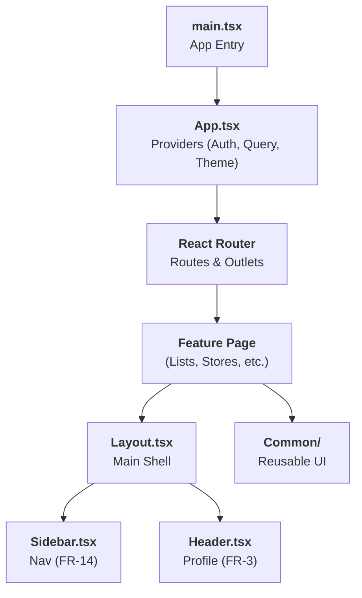

# UI Architecture

## Overview

The Home Application frontend is built as a highly interactive **Single Page Application (SPA)** that emphasizes performance, real-time collaboration, and a mobile-first user experience.

<div class="grid cards" markdown>

-   :material-sitemap-outline: **Hierarchical Design**
    
    Modular component structure with clear separation between layouts, functional pages, and shared UI primitives.

-   :material-cached: **Server State**
    
    Advanced caching and synchronization logic to minimize latency and support collaborative workflows.

-   :material-devices: **Adaptive UI**
    
    Fluid responsiveness ensuring usability from desktop monitors down to single-handed mobile use in-store.

</div>

---

## Tech Stack

=== "Core"

    | Tool | Purpose | link |
    | :--- | :--- | :--- |
    | :fontawesome-brands-react: **React 19** | UI library with Concurrent rendering and improved hooks. | [Site](https://react.dev/) |
    | :material-palette: **Mantine 7** | Core component library for layout, forms, and theming. | [Site](https://mantine.dev/) |
    | :material-sync: **TanStack Query** | Server state management, caching, and optimistic updates. | [Site](https://tanstack.com/query/latest) |
    | :material-router: **React Router 7** | Client-side routing with nested layout support. | [Site](https://reactrouter.com/) |

=== "Utilities"

    | Tool | Purpose |
    | :--- | :--- |
    | :material-barcode: **react-barcode** | Linear 1D barcode generation (Code 128). |
    | :material-qrcode: **qrcode.react** | 2D QR code generation for digital cards. |
    | :material-clock-outline: **date-fns** | Modern date manipulation and formatting. |
    | :material-alphabetical: **Tabler Icons** | High-quality SVG icon system. |

---

## Component Architecture

### Component Hierarchy

The application follows a nested layout pattern. Providers at the root inject global state (Auth, Query Client, Theme) into the component tree.



### Folder Structure

```text
src/
├── App.tsx              # Application shell & providers
├── theme.ts             # Mantine theme configuration
├── components/          # Reusable components
│   ├── Layout.tsx       # Main layout wrapper
│   ├── Sidebar.tsx      # Navigation (FR-14)
│   └── shopping/        # Domain-specific UI
├── context/             # React Context (Auth)
├── hooks/               # Custom hooks (useStore, useList)
├── pages/               # Route-level components
├── services/
│   └── api.ts           # Fetch client with CSRF support
├── types/               # TypeScript interfaces
└── utils/               # Formatting & calculations
```

---

## State Management

The application leverages **TanStack Query v5** to manage all asynchronous server state. This strategy minimizes unnecessary network traffic and ensures a highly responsive user interface.

### Server State & Caching

The "Server Cache" acts as the source of truth for all domain data. By configuring granular caching policies, the frontend achieves near-instant navigation between views.

!!! note "[:octicons-rocket-24: NFR-2: Performance (Latency)](../../requirements/shared.md#nfr-2)"

    To meet the 150ms latency target, reference data (Categories, Stores) is cached with a long `staleTime`, while volatile data (Shopping Lists) uses aggressive invalidation.

**Global Query Defaults:**
- **`staleTime: 5 * 60 * 1000`**: Data is considered "fresh" for 5 minutes.
- **`gcTime: 10 * 60 * 1000`**: Unused data is kept in memory for 10 minutes before garbage collection.
- **`retry: 1`**: Failed requests are retried once before showing an error UI.

**Example: Cached Store Data**
```typescript
export const useStores = () => {
  return useQuery({
    queryKey: ['stores'],
    queryFn: () => api.get<Store[]>('/api/shopping/stores'),
    staleTime: 10 * 60 * 1000, // Stores change rarely (fresh for 10m)
  });
};
```

### Data Synchronization & Mutations

Mutations handle all data-modifying operations (POST, PUT, DELETE). To ensure the UI reflects changes immediately, the application employs two primary strategies: **Invalidation** and **Optimistic Updates**.

!!! note "[:octicons-sync-24: NFR-3: Reliability & Sync](../../requirements/shopping-list.md#nfr-3)"

    Mutations implement Optimistic Updates to ensure the UI remains responsive and functional even under high latency or intermittent connectivity.

#### Pattern: Optimistic Update (Item Check-off)

When a user checks off an item, the UI is updated immediately *before* the server responds. If the server request fails, the UI is rolled back to the previous state.

```typescript
export const useCheckItem = (listId: number) => {
  const queryClient = useQueryClient();

  return useMutation({
    mutationFn: (itemId: number) => api.patch(`/api/shopping/lists/${listId}/items/${itemId}/toggle`),
    
    // Step 1: Cancel outgoing fetches
    onMutate: async (itemId) => {
      await queryClient.cancelQueries({ queryKey: ['shopping-list', listId] });
      const previousList = queryClient.getQueryData(['shopping-list', listId]);

      // Step 2: Optimistically update the cache
      queryClient.setQueryData(['shopping-list', listId], (old: ShoppingList) => ({
        ...old,
        items: old.items.map(i => i.id === itemId ? { ...i, bought: !i.bought } : i)
      }));

      return { previousList }; // Return context for rollback
    },

    // Step 3: Rollback on error
    onError: (err, itemId, context) => {
      queryClient.setQueryData(['shopping-list', listId], context?.previousList);
      notifications.show({ color: 'red', message: 'Failed to sync update' });
    },

    // Step 4: Always refetch after error or success to sync with server
    onSettled: () => {
      queryClient.invalidateQueries({ queryKey: ['shopping-list', listId] });
    },
  });
};
```

---

## Navigation & Layout

### Modular Sidebar

!!! note "[:material-menu: FR-14: Module Navigation](../../requirements/shared.md#fr-14)"

    The application implements a persistent, nested navigation system that adapts to user roles and persists its state across sessions.

- **Persistence:** The expanded/collapsed state of parent menus (Shopping, Settings) is persisted in `localStorage`.
- **RBAC:** Navigation items are conditionally rendered based on the user's Age Group (e.g., Settings is hidden for "Child" or "Teenager").

### User Profile Quick View

!!! note "[:material-account-box: FR-3: User Profile Quick View](../../requirements/auth-profile.md#fr-3)"

    The header dropdown provides an immediate summary of the user's identity, including dynamic social links and role status.

- Rendered as a dropdown in the `Header`.
- Displays dynamic icons for LinkedIn, Facebook, and Instagram based on the presence of profile URLs.
- Provides a direct link to the full Profile Update page.

---

## UI Logic & Specialized Rendering

### Barcode Generation

!!! note "[:material-barcode-scan: FR-12: Loyalty Cards](../../requirements/shopping-list.md#fr-12)"

    Digital loyalty cards are rendered as industry-standard linear barcodes (Code 128) or QR codes to ensure compatibility with physical store scanners.

```tsx
<Barcode 
  value={cardNumber} 
  format="CODE128" 
  width={2} 
  height={100} 
  displayValue={false} 
/>
```

### Coupon Urgency Logic

!!! note "[:material-alert-decagram: FR-15: Expiration Warning Panel](../../requirements/shopping-list.md#fr-15)"

    The dashboard proactively highlights coupons nearing their expiration date using a time-based urgency calculation.

```typescript
const isUrgent = (dueDate: string): boolean => {
  const daysRemaining = differenceInDays(new Date(dueDate), new Date());
  return daysRemaining <= 3; // Highlight within 3 days of expiry
};
```

---

## Implementation Standards

### Form Management
- All user inputs are handled via `@mantine/form`.
- **Validation:** Synchronous client-side validation for phone formats and URL patterns (matching backend regex).

### Build & Quality
- **Bundler:** Vite 6 for rapid HMR (Hot Module Replacement).
- **Gradle Integration:** The frontend build is wrapped in a Gradle task (`:home-app-frontend:build`) to ensure it runs during CI.
- **Linting:** Strict ESLint configuration using `eslint-plugin-react-refresh`.

---

## Related Documentation

- [:material-server: Backend Architecture](../backend/overview.md)
- [:material-api: API Design](../backend/api/index.md)
- [:material-test-tube: Test Architecture](../test-strategy/architecture.md)
