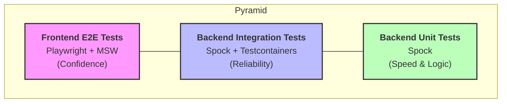

# Test Architecture

## Overview

The Home Application follows a robust testing strategy designed to ensure reliability, security, and performance across both frontend and backend modules.

## Test Pyramid

The project adheres to a balanced testing strategy, prioritizing backend unit and integration tests while maintaining high-confidence frontend E2E suites.

## Test Frameworks and Tools

=== "Backend"

    | Name | Description / Purpose |
    |------|-----------------------|
    | [:material-test-tube: **Spock**](https://spockframework.org/) | Behavior-driven development (BDD) testing framework for Java and Groovy applications. |
    | [:simple-docker: **Testcontainers**](https://java.testcontainers.org/) | Provides lightweight, throwaway instances of PostgreSQL 17 for integration tests. |
    | [:material-api: **WireMock**](https://wiremock.org/) | Mocks external HTTP-based services like the Google People API. |
    | [:material-chart-bar: **JaCoCo**](https://www.jacoco.org/jacoco/) | Generates comprehensive code coverage reports for Java and Groovy code. |
    | [:material-shield-check: **Spring Security Test**](https://docs.spring.io/spring-security/reference/servlet/test/index.html) | Utilities for testing Spring Security configurations and role-based access control. |

=== "Frontend"

    | Name | Description / Purpose |
    |------|-----------------------|
    | [:material-play-circle: **Playwright**](https://playwright.dev/) | Framework for reliable end-to-end testing across modern web browsers. |
    | [:material-network-outline: **MSW**](https://mswjs.io/) | Mock Service Worker for API mocking in E2E tests. |

## Testing Layers

### 1. Unit Tests (Base)
- **Scope:** Individual backend services and utility functions.
- **Backend:** **Spock** for business logic and adapter transformations.
- **Goal:** Exhaustive coverage of edge cases and business rules.

### 2. Integration Tests (Middle)
- **Scope:** API endpoints, database interactions, and external service contracts.
- **Tools:** **Spock** + **Testcontainers** (PostgreSQL 17).
- **External APIs:** **WireMock** for Google People API simulation.
- **Goal:** Verify data persistence, security constraints (RBAC), and transactional integrity.

### 3. E2E Tests (Top)
- **Scope:** Complete user journeys across the UI.
- **Tools:** **Playwright** with **MSW** (Mock Service Worker) for controlled state.
- **Goal:** Validate critical paths like onboarding, collaborative shopping, and role-based access.

## Coverage & Quality Targets

!!! note "[:octicons-rocket-24: NFR-2: Performance (Latency)](../../requirements/shared.md#nfr-2)"

    Performance tests MUST ensure that 95% of API requests complete in < 150ms.

| Metric | Target | Tool |
| :--- | :--- | :--- |
| **Backend Code Coverage** | > 80% (Lines) | JaCoCo |
| **Build Stability** | 100% Success | GitHub Actions |
| **API Latency** | < 150ms (p95) | Custom Metrics |
| **Security** | 0 Critical Vulnerabilities | Dependency Check |

## CI/CD Pipeline

Tests are executed automatically on every Pull Request via GitHub Actions. A change is only considered "Ready for Review" once all suites pass and coverage targets are met.
