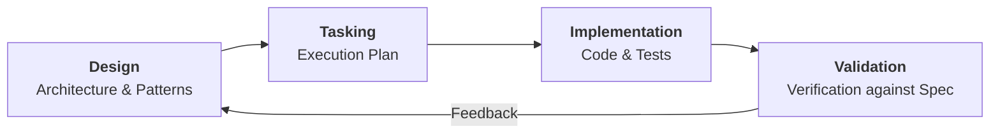

# Roadmap & Execution

## Overview

In the **Spec-Driven Development (SDD)** workflow, task files represent the bridge between high-level architectural design and the actual code implementation. They serve as the definitive "Execution Plan," breaking down complex features into transactional, verifiable units of work that ensure the final product aligns perfectly with the established requirements.

Each task file is structured to guide the developer through a deterministic implementation path, starting from environment setup and schema migrations to backend logic, frontend components, and finally, automated verification. This methodology eliminates ambiguity during the build phase and provides a clear audit trail for progress tracking and quality assurance.

## Task Lifecycle

---

## Active Roadmap

These modules are currently defined and follow the sequential rollout plan:

| Milestone | Module                                                      | Status                            |
|:----------|:------------------------------------------------------------|:----------------------------------|
| **01**    | [**User Profile Updates**](01-update-user-profile.tasks.md) | :material-check-circle: Completed |
| **02**    | [**Shopping List Module**](02-shopping-list.tasks.md)       | :material-check-circle: Completed |
| **03**    | [**Family Hierarchy**](03-family-hierarchy.tasks.md)        | :material-check-circle: Completed |
| **04**    | [**Recipes & Meals**](04-recipes-meals.tasks.md)            | :material-check-circle: Completed |

### Implementation Notes (Milestone 04)

!!! warning "Scope Changes During Implementation"

    The following deviations from the original specification occurred during Milestone 04:

    - **FR-32 (Meal Plan Approval Workflow):** Intentionally **dropped**. The per-member PENDING/ACCEPTED/CHANGED tracking was deemed too complex. Only the publish & notify flow was implemented.
    - **FR-33 (Meal Preparation Reminders):** **Deferred**. The `MealReminderScheduler` service is scaffolded but the `reminder_offset_minutes` column is not yet in the schema.
    - **New features added:** Centralized media service (FR-42), nutrient master catalog (FR-40), standalone meal items (FR-41), ingredient grouping, recipe multipliers, coupon barcodes, item unavailability.

---

## Backlog

These are candidate features that have been identified for future implementation but have not yet been formalized into requirements or design specs.

!!! info "Meal Preparation Reminders (FR-33)"

    Complete the meal reminder implementation: add `reminder_offset_minutes` column to `meal_plan_entries`, wire the `MealReminderScheduler` to query upcoming meals and generate `MEAL_REMINDER` notifications.

!!! info "Health Tracking"

    A new module to track health mtrics such as weight and measures. ideally integrated with apple/google health.

!!! info "Family Calendar"

    A shared household calendar for tracking events, appointments, and important family dates, with integration for automated reminders.

!!! info "Household Tasks"

    A collaborative task manager for managing recurring household chores, maintenance schedules, and shared responsibilities.

!!! info "Family Wish List"

    A centralized list for tracking desired items, gift ideas, and future purchases, allowing family members to contribute and coordinate.

!!! info "Finances Planning"

    A comprehensive budget and expense tracking module to manage common household costs, savings goals, and shared bills.

!!! info "Travel Management"

    A coordination hub for family trips, including itinerary planning, document storage (passports, tickets), and shared packing lists.

!!! info "Licenses & Warranty Database"

    A secure vault for tracking software licenses, appliance warranties, and subscription renewal dates.

!!! info "Shared Passwords"

    A highly secure, encrypted storage for common household credentials such as streaming services, utilities, and insurance portals.

!!! info "K8s Deployment Module"

    A specialized Gradle module to manage Infrastructure-as-Code for deploying the entire application stack to a Kubernetes cluster.
